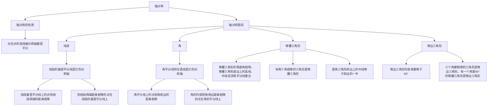

# 义务教育教科书 数学 八年级 上册

---
## 封面


**义务教育教科书**

**数学**
**SHU XUE**
**八年级 上册**

**教育部审定 2013**

**R 江苏凤凰科学技术出版社**

---
## 封面 (含主编信息)


**义务教育教科书**

**数学**
**SHU XUE**
**八年级 上册**

**杨裕前 董林伟 主编**

**R 江苏凤凰科学技术出版社**
**南京**

---
## 致同学

**亲爱的少年朋友：**

一个学年已经过去了，你们的知识也一定增长了，在七年级的数学学习中，如果你感觉很好，请记住“山外有山”，数学世界的奥秘还有待于进一步探索；如果你感到有困难，请相信“后来者能够居上”，努力永远不会嫌迟。让我们人人都充满自信地走进八年级的数学课程吧！

“全等三角形”将引导你探索全等图形的性质，以及两个三角形全等的条件；学习用演绎推理的方法证明两个三角形全等。

“轴对称图形”将引导你用数学的眼光观察、欣赏生活中许多漂亮的图案，把折纸等现象与图形的运动变化联系起来；在探索轴对称性质的基础上，进一步研究一些较复杂图形的性质，并学会用“对称”设计图案。

“勾股定理”将介绍人类的文明成果——勾股定理，进而学习勾股定理的逆定理，并应用它们解决一些简单的实际问题。

“实数”将引导你学习平方根、立方根，实数的概念及运算。

“平面直角坐标系”将介绍确定物体位置的方法，学习研究数量与位置之间关系的有效工具——平面直角坐标系。

“一次函数”将引导你探索一类事物中数量的关系和变化规律，了解研究函数的一些基本方法，并初步感受一次函数与二元一次方程之间的联系。

做做“实验”，与同学“讨论”；仔细“观察”，积极“探索”；认真“练习”，勤于“思考”；读读“读一读”及“阅读”材料，拓宽视野；把做与想更好地结合起来。

充满自信，选择适合自己的学习方法，会使你的数学学习不断取得成功！

---
## 目录

### 第1章 全等三角形
1.1 全等图形 ················································································································· 6
1.2 全等三角形 ··········································································································· 9
1.3 探索三角形全等的条件 ······················································································· 13
数学活动 关于三角形全等的条件 ··············································································· 33
小结与思考 ················································································································· 34
复习题 ······················································································································· 34

### 第2章 轴对称图形
2.1 轴对称与轴对称图形 ··························································································· 40
2.2 轴对称的性质 ····································································································· 43
2.3 设计轴对称图案 ································································································· 48
2.4 线段、角的轴对称性 ··························································································· 51
2.5 等腰三角形的轴对称性 ······················································································· 60
数学活动 折纸与证明 ······························································································· 69
小结与思考 ················································································································· 71
复习题 ······················································································································· 72

1

---
### 第3章 勾股定理
3.1 勾股定理 ············································································································· 78
3.2 勾股定理的逆定理 ····························································································· 83
3.3 勾股定理的简单应用 ························································································· 86
数学活动 探寻“勾股数” ··························································································· 89
小结与思考 ················································································································· 90
复习题 ······················································································································· 90

### 第4章 实数
4.1 平方根 ················································································································· 94
4.2 立方根 ················································································································· 99
4.3 实数 ··················································································································· 101
4.4 近似数 ··············································································································· 107
数学活动 有关“实数”的课题探究 ··········································································· 110
小结与思考 ··············································································································· 110
复习题 ····················································································································· 111

### 第5章 平面直角坐标系
5.1 位置的确定 ······································································································· 116

2

---
5.2 平面直角坐标系 ································································································· 120
数学活动 确定藏宝地 ····························································································· 131
小结与思考 ··············································································································· 131
复习题 ····················································································································· 132

### 第6章 一次函数
6.1 函数 ··················································································································· 136
6.2 一次函数 ··········································································································· 144
6.3 一次函数的图像 ······························································································· 148
6.4 用一次函数解决问题 ························································································· 155
6.5 一次函数与二元一次方程 ················································································· 160
6.6 一次函数、一元一次方程和一元一次不等式 ····················································· 163
数学活动 温度计上的一次函数 ··············································································· 166
小结与思考 ··············································································································· 166
复习题 ····················································································································· 167

课题学习 关于勾股定理的研究 ··············································································· 171

数学活动评价表 ······································································································· 172

3

---
## 第1章 全等三角形

生活中处处可见全等的图案；
探索全等图形的性质，揭示它的奥秘。

△ABC ≅ △ADC

---
用正方形纸片按图中所示的步骤制作若干个“枫叶”，再用它们拼成一幅由“枫叶”组成的图案。

用纸板挡住了两个三角形的一部分，你能画出这两个三角形吗？如果能，你画的三角形与其他同学画的三角形的形状、大小相同吗？

本章将认识全等图形以及全等三角形，探索两个三角形全等的条件，探索并证明有关全等三角形的一些命题，学习有条理的思考和表达。

---
## 1.1 全等图形

像以上图案中的邮票、蝴蝶、交通标识，它们的形状、大小分别相同，分别能完全重合。日常生活中，你见过这样的图案吗？

能完全重合的图形叫做**全等图形** (congruent figures)。两个图形全等，它们的形状、大小相同。

---
### 【交流】

观察图 1-1，从中找出全等图形。

(1) (2) (3) (4) (5) (6)
(7) (8) (9) (10) (11) (12)

**图 1-1**

### 【操作】

观察图 1-2(1)、(2)、(3)中的两个全等图形，怎样改变其中一个图形的位置可以与另一个图形完全重合？按照同样的方法，在图 1-2 中分别画出第3个、第4个图形。

**(1)**
**(2)**
**(3)**

**图 1-2**

---
### 【练习】

1. 找出图中的全等图形。
   (第1题) (第2题)

2. 用不同的方法沿网格线把正方形分割成两个全等的图形。

### 习题 1.1

1. 找出下列各组图中的全等图形。
   (1) ① ② ③ ④
   (2) ① ② ③ ④
   (第1题)

2. 用不同的方法把图中的平行四边形分成4个全等的图形。
   (第2题) (第3题)

3. 把图中的等边三角形分成2个、3个、4个全等的图形。

---
## 1.2 全等三角形

信封上盖的两个三角形纪念邮戳能够完全重合。

两个能完全重合的三角形叫做**全等三角形** (congruent triangles)。
图 1-3 中的△ABC 和△A'B'C' 是全等三角形，记作“△ABC ≅ △A'B'C'”，读作“△ABC 全等于△A'B'C'”。顶点 A 和 A'、B 和 B'、C 和 C'叫做**对应顶点** (corresponding vertices)，AB 和 A'B'、BC 和 B'C'、AC 和 A'C'叫做**对应边** (corresponding sides)，∠A 和 ∠A'、∠B 和 ∠B'、∠C 和 ∠C'叫做**对应角** (corresponding angles)。

表示两个三角形全等时，通常把对应顶点的字母写在对应的位置上。

> 全等三角形的对应边相等，对应角相等。

### 【操作】

用硬纸片剪一个三角形，在白纸上画一个与三角形纸片全等的△ABC，并把三角形纸片与△ABC叠合在一起。

---
### 【讨论】

(1) 把三角形纸片沿 AB 所在直线平移一定的距离，画出所得的△A'B'C'；
(2) 把三角形纸片沿 AC 所在直线翻折，画出得到的△A'B'C'；
(3) 把三角形纸片绕顶点 A 旋转 180°，画出所得到的△AB'C'。

怎样改变图 1-4(1)中△ABC 的位置，使它与△DEF 重合？
怎样改变图 1-4(2)中△ABC 的位置，使它与△DBC 重合？
怎样改变图 1-4(3)中△ABC 的位置，使它与△DEC 重合？

(1) A D B C E F
(2) C A D B
(3) E A C D B

**图 1-4**

### 【练习】

1. 如图，△ABC ≅ △CDA，写出图中相等的边和角。
   (第1题) (第2题)

2. 怎样改变图案中△ABC、△DOE 的位置，才能与其他相应的三角形重合？

---
### 【阅读】图形的运动

图(1)中，点 B、C、E 在一条直线上，△ABC ≅ △DCE，我们只需把△ABC 沿直线 BC 平移 BC 的长度，就能使△ABC 与△DCE 完全重合。
图(2)中，点 B、D、C 在一条直线上，△ABD ≅ △ACD，我们只需把△ABD 沿 AD 所在直线翻折，就能使△ABD 与△ACD 完全重合。
图(3)中，AC、BD 相交于点 O，△AOB ≅ △COD，我们只需把△AOB 绕点 O 旋转 180°，就能使△AOB 与△COD 完全重合。

图(1) A D B C E
图(2) A B D C
图(3) A B O D C

图形的运动(平移、翻折、旋转)只改变图形的位置，不改变图形的形状、大小，运动前、后的两个图形全等。
一个图形经过多次平移、旋转、翻折，所得到的图形与运动前的图形仍然全等。

试试分别说出图(4)～图(9)中的一个三角形经过怎样的运动就与另一个三角形重合。

图(4) 图(5) 图(6)
图(7) 图(8) 图(9)

---
### 习题 1.2

1. 如图，△OMQ ≅ △OPN，写出这两个三角形中的对应边和对应角。
   (第1题) M P O Q N
   (第2题) E D O B C

2. 如图，△BCE ≅ △CBD，写出这两个三角形中的对应边和对应角。

3. 如图，△ABC ≅ △DBC，∠A = 45°，∠ACD = 76°。求△BCD 各内角的度数。
   C A B D
   (第3题)

---
## 1.3 探索三角形全等的条件

我们知道，如果两个三角形全等，那么它们的对应边相等、对应角相等。反过来，当两个三角形具备多少对边或角分别相等时，这两个三角形就全等呢？

### 【讨论】

1. 当两个三角形的1对边或角相等时，它们全等吗？
2. 当两个三角形的2对边或角分别相等时，它们全等吗？
3. 当两个三角形的3对边或角分别相等时，它们全等吗？

### 【交流】

1. 如图 1-5，每人用一张长方形纸剪一个直角三角形，怎样才能使剪下的所有直角三角形都能够重合？

2. 在图 1-6 中，△ABC 与△DEF、△MNP 能完全重合吗？
   A 45° 5 B 3 C
   D 60° 5 E F
   M 3 45° N 4.5 P
   **图 1-5**

按下列作法，用直尺和圆规作△ABC，使∠A = ∠α，AB = a，AC = b。

| 作法 | 图形 |
| :--- | :--- |
| 1. 作∠MAN = ∠α。 | α |
| 2. 在射线 AM、AN 上分别作线段 AB=a, AC=b。 | a, b |
| 3. 连接 BC。△ABC 就是所求作的三角形。 | |

你作的三角形与其他同学作的三角形能完全重合吗？

---
实践告诉我们判定两个三角形全等的一个基本事实：

> 两边及其夹角分别相等的两个三角形全等 (可以简写成“边角边”或“SAS”)。

**例1** 已知：如图 1-7，AB = AD，∠BAC = ∠DAC。
求证：△ABC ≅ △ADC。
**证明：** 在△ABC 和△ADC 中，
```
{ AB = AD (已知)，
{ ∠BAC = ∠DAC (已知)，
{ AC = AC (公共边)，
```
∴ △ABC ≅ △ADC (SAS)。

**图 1-7** D A C B
> 其中一个三角形沿AC所在直线翻折后，能与另一个三角形重合。

### 【练习】

1. 找出图中的全等三角形，并说明理由：
   (① 30°, 5) (② 40°, 5, 4) (③ 40°, 4, 5)
   (④ 30°, 5) (⑤ 40°, 6, 4) (⑥ 30°, 5)
   (第1题)

2. 已知：如图，AB = AC，点 D、E 分别在 AB、AC 上，且 AD = AE。
   求证：△ABE ≅ △ACD。
   B D A E C
   (第2题)

---
### 【读一读】图形的运动与“SAS”

本节中，我们知道了判定两个三角形全等的一个基本事实——两边及其夹角分别相等的两个三角形全等(SAS)，其实，我们可以用图形运动的方法来确认它的正确性。
如图(1)，在△ABC 和△A'B'C' 中，AB = A'B'，∠B = ∠B'，BC = B'C'。

A A' B C B' C'
(1)
A(A') B(B') C(C')
(2)

把△ABC 叠合到△A'B'C' 上，使 BC 与 B'C' 重合，∠B、∠B' 落在 BC 的同一侧。
因为∠B = ∠B'，所以 BA 落在射线 B'A' 上，又因为 BA = B'A'，所以点 A 与点 A' 重合。根据“两点确定一条直线”，可以知道 AC 与 A'C' 重合。于是△ABC 与△A'B'C' 重合(如图(2))，即△ABC ≅ △A'B'C'。
试仿照上面的方法，证实本节例1中的结论。

**例2** 已知：如图 1-8，AB、CD 相交于点 E，且 E 是 AB、CD 的中点。
求证：△AEC ≅ △BED。
**证明：** ∵ E 是 AB、CD 的中点(已知)，
∴ AE = BE，CE = DE(线段中点的定义)。
在△AEC 和△BED 中，
```
{ AE = BE (已证)，
{ ∠AEC = ∠BED (对顶角相等)，
{ CE = DE (已证)，
```
∴ △AEC ≅ △BED (SAS)。
> 其中一个三角形绕点E旋转180°后，能与另一个三角形重合。

**图 1-8** A C E D B

---
### 【讨论】

你能证明图 1-8 中 AC // DB 吗？

**例3** 已知：如图 1-9，点 E、F 在 CD 上，且 CE = DF，AE = BF，AE // BF。
求证：△AEC ≅ △BFD。
**证明：** ∵ AE // BF (已知)，
∴ ∠AEC = ∠BFD (两直线平行，内错角相等)。
在△AEC 和△BFD 中，
```
{ AE = BF (已知)，
{ ∠AEC = ∠BFD (已证)，
{ CE = DF (已知)，
```
∴ △AEC ≅ △BFD (SAS)。
> 能否改变图1-9中△AEC的位置得到图1-8？

**图 1-9** A C F E D B

### 【讨论】

根据例3中的已知条件，你还能证得其他新的结论吗？

### 【练习】

填空 (第1、2题)：
1. 已知：如图，C 是 AB 的中点，AE = BD，∠A = ∠B。
   求证：∠E = ∠D。
   **证明：** ∵ C 是 AB 的中点(已知)，
   ∴ ___ = ___ ( )。
   在△AEC 和△BDC 中，
   ```
   { ___ = ___ ( )，
   { ∠___ = ∠___ ( )，
   { ___ = ___ ( )，
   ```
   ∴ △AEC ≅ △BDC ( )。
   ∴ ∠E = ∠D ( )。
   D E A C B
   (第1题)

2. 已知：如图，点 D 在 AE 上，BD = CD，∠BDE = ∠CDE。
   求证：AB = AC。
   **证明：** ∵ ∠BDE + ∠___ = 180°，
   ∠CDE + ∠___ = 180°(平角的定义)，

---
∠BDE = ∠CDE(已知)，
∴ ∠___ = ∠___ ( )。
在△ABD 和△ACD 中，
```
{ ___ = ___ ( )，
{ ∠___ = ∠___ ( )，
{ ___ = ___ ( )，
```
∴ △ABD ≅ △ACD ( )。
∴ AB = AC ( )。
B A D E C
(第2题)

3. 已知：如图，AB // CD，AB = CD。
   求证：AD // BC。
   A D B C
   (第3题)

### 【讨论】

1. 用纸板挡住了两个三角形的一部分，你能画出这两个三角形吗？如果能，你画的三角形与其他同学画的三角形能完全重合吗？

2. 在图 1-10 中，△ABC 与△PQR、△DEF 能完全重合吗？
   A 40° 60° B 2.5 C
   O 2.5 40° P 60° R Q
   D 2.5 40° 60° E F
   **图 1-10**

---
### 【操作】

按下列作法，用直尺和圆规作△ABC，使 AB = a，∠A = ∠α，∠B = ∠β。

| 作法 | 图形 |
| :--- | :--- |
| 1. 作 AB = a。 | a |
| 2. 在 AB 的同一侧分别作∠MAB = ∠α，∠NBA = ∠β，AM、BN 相交于点 C。△ABC 就是所求作的三角形。 | α, β |

你作的三角形与其他同学作的三角形能完全重合吗？

实践告诉我们判定两个三角形全等的又一个基本事实：

> 两角及其夹边分别相等的两个三角形全等 (可以简写成“角边角”或“ASA”)。

**例4** 已知：如图 1-11，在△ABC 中，D 是 BC 的中点，点 E、F 分别在 AB、AC 上，且 DE // AC，DF // AB。
求证：BE = DF，DE = CF。
**分析：** 要证 BE = DF，DE = CF，只要证△EBD ≅ △FDC，由于 D 是 BC 的中点，已知 BD = DC，所以只要证∠B = ∠FDC，∠EDB = ∠C。
**证明：** ∵ DE // AC，DF // AB(已知)，
∴ ∠EDB = ∠C，∠B = ∠FDC(两直线平行，同位角相等)。
∵ D 是 BC 的中点(已知)，
∴ BD = DC(线段中点的定义)。
在△EBD 和△FDC 中，
```
{ ∠EDB = ∠C(已证)，
{ BD = DC(已证)，
{ ∠B = ∠FDC(已证)，
```
∴ △EBD ≅ △FDC (ASA)。
∴ BE = DF，DE = CF(全等三角形的对应边相等)。

**图 1-11** A E F B D C

---
### 【练习】

1. 找出图中的全等三角形，并说明理由。
   (① C 25° 75° A B 7) (② X 60° 50° Y Z 7) (③ P 25° 110° Q R 7)
   (④ S 50° 70° W T 7) (⑤ F 25° 110° D E 7) (⑥ N 125° 75° G M 7)
   (第1题)

2. 已知：如图，AB、CD 相交于点 O，O 是 AB 的中点，AC // BD。
   求证：O 是 CD 的中点。
   C O A D B
   (第2题)

### 【思考】

如图 1-12，在△ABC 和△MNP 中，∠A = ∠M，∠B = ∠N，BC = NP。△ABC 与△MNP 全等吗？为什么？
A M B C N P
**图 1-12**
> 由三角形内角和定理可知∠C = ∠P。
> 根据“ASA”可以证明△ABC ≅ △MNP。

---
由此可以得到基本事实 (ASA) 的推论：

> 两角分别相等且其中一组等角的对边相等的两个三角形全等 (可以简写成“角角边”或“AAS”)。

**例5** 已知：如图 1-13，△ABC ≅ △A'B'C'，AD、A'D'分别是△ABC 和△A'B'C' 的高。
求证：AD = A'D'。
A A' B D C B' D' C'
**图 1-13**

**分析：** 要证 AD = A'D'，只要证△ABD ≅ △A'B'D'，由于在△ABD 和△A'B'D' 中，∠ADB = ∠A'D'B' = 90°，所以只要证 AB = A'B'，∠B = ∠B'。
**证明：** ∵ △ABC ≅ △A'B'C'(已知)，
∴ AB = A'B'，∠B = ∠B'(全等三角形的对应边相等、对应角相等)。
∵ AD、A'D'分别是△ABC 和△A'B'C' 的高(已知)，
∴ ∠ADB = ∠A'D'B' = 90°。
在△ABD 和△A'B'D'中，
```
{ ∠B = ∠B'(已证)，
{ ∠ADB = ∠A'D'B'(已证)，
{ AB = A'B'(已证)，
```
∴ △ABD ≅ △A'B'D' (AAS)。
∴ AD = A'D'(全等三角形的对应边相等)。

### 【讨论】

在图 1-13 中，如果 AD、A'D'分别是△ABC 和△A'B'C' 的角平分线(或中线)，那么 AD 与 A'D'相等吗？试证明你的结论。

---
### 【练习】

1. 已知：如图，∠A = ∠D，∠ACB = ∠DBC。
   求证：AB = DC。
   A D B C
   (第1题)

2. 已知：如图，CB ⊥ AD，AE ⊥ DC，垂足分别为 B、E，AE、BC 相交于点 F，且 AB = BC。
   求证：△ABF ≅ △CBD。
   C E F A B D
   (第2题)

### 【讨论】

1. 如图 1-14，∠A = ∠B，∠1 = ∠2，EA = EB。你能证明 AC = BD 吗？
   E D A C 1 2 B
   **图 1-14**

2. 如图 1-15，点 C、F 在 AD 上，且 AF = DC，∠B = ∠E，∠A = ∠D。你能证明 AB = DE 吗？
   B A C F D E
   **图 1-15**

**例6** 已知：如图 1-16，点 A、B、C、D 在一条直线上，EA // FB，EC // FD，EA = FB。
求证：AB = CD。
E F A B C D
**图 1-16**

---
**分析：** 要证 AB = CD，只要证 AB + BC = CD + BC，即 AC = BD。所以只要证△EAC ≅ △FBD。
**证明：** ∵ EA // FB，EC // FD(已知)，
∴ ∠A = ∠FBD，∠ECA = ∠D(两直线平行，同位角相等)。
在△EAC 和△FBD 中，
```
{ ∠A = ∠FBD(已证)，
{ ∠ECA = ∠D(已证)，
{ EA = FB(已知)，
```
∴ △EAC ≅ △FBD (AAS)。
∴ AC = BD(全等三角形的对应边相等)。
即 AB + BC = CD + BC。
∴ AB = CD(等式的性质)。

上面的推理过程可以用符号“⇒”简明地表述如下：
EA // FB ⇒ ∠A = ∠FBD
EC // FD ⇒ ∠ECA = ∠D ⇒ △EAC ≅ △FBD ⇒ AC = BD ⇒ AB + BC = CD + BC ⇒ AB = CD
EA = FB

### 【练习】

1. 已知：如图，AB = AC，点 D、E 分别在 AB、AC 上，∠1 = ∠2。
   求证：DB = EC。
   A D E 1 2 B C
   (第1题)

2. 已知：如图，∠ABC = ∠DCB，∠1 = ∠2。
   求证：AB = DC。
   A D 1 2 B C
   (第2题)

---
### 【操作】

按下列作法，用直尺和圆规作△ABC，使 AB = c，AC = b，BC = a。

| 作法 | 图形 |
| :--- | :--- |
| 1. 作线段 BC = a。 | a |
| 2. 分别以点 B、C 为圆心，c、b 的长为半径画弧，两弧相交于点 A。 | b, c |
| 3. 连接 AB、AC。△ABC 就是所求作的三角形。 | |

你作的三角形与其他同学作的三角形能完全重合吗？

实践告诉我们判定两个三角形全等的第三个基本事实：

> 三边分别相等的两个三角形全等 (可以简写成“边边边”或“SSS”)。

生活经验告诉我们，如果一个三角形三边的长度确定，那么这个三角形的形状和大小就完全确定。如图 1-17，用3根木条钉成的三角形框架，它的形状和大小一确定，这就说明了“三边分别相等的两个三角形全等”。
三角形的这个性质叫做三角形的稳定性。
三角形的稳定性在生产和生活中有者广泛的应用。

**图 1-17**
(工地塔吊) (空调架)

---
### 【讨论】

四边形是否具有稳定性？
> 用4根木条钉成的四边形框架是可以改变的。

四边形不具有稳定性，也就是说，当一个四边形四边的长度确定时，这个四边形的形状、大小不唯一确定。

**例7** 已知：在△ABC 中，AB = AC。
求证：∠B = ∠C。
**分析：** 要证∠B = ∠C，只要设法使∠B、∠C分别在两个三角形中，然后证明这两个三角形全等。
**证明：** 作△ABC 的中线 AD。
在△ABD 和△ACD 中，
```
{ AB = AC(已知)，
{ BD = CD(辅助线作法)，
{ AD = AD(公共边)，
```
∴ △ABD ≅ △ACD (SSS)。
∴ ∠B = ∠C(全等三角形的对应角相等)。
**图 1-18** A B D C

### 【思考】

还有不同的方法证明∠B = ∠C吗？

### 【练习】

1. 三对角分别相等的两个三角形全等吗？
2. 已知：如图，AB=DC，AD=BC。求证：AB//DC，AD//BC。
   A D B C
   (第2题)

3. 如图，△DEF 的3个顶点分别在小正方形的顶点(格点)上，这样的三角形叫做格点三角形。请在图中再画1个格点三角形ABC，使△ABC ≅ △DEF。这样的格点三角形你能画几个？
   A E D B F C
   (第3题)

---
### 【思考】

工人师傅常常利用角尺平分一个角。如图 1-19，在∠AOB 的两边 OA、OB 上分别任取 OC = OD，移动角尺，使角尺两边相同的刻度分别与点 C、D 重合，这时过角尺顶点 M 的射线 OM 就是∠AOB 的平分线。请你说明这样画角平分线的道理。
> 由OC=OD, MC=MD, OM=OM, 可知△OCM ≅ △ODM, 于是∠COM = ∠DOM, 即OM平分∠AOB。

**图 1-19** C M O D B A

按下列作法，用直尺和圆规作∠AOB 的平分线。

| 作法 | 图形 |
| :--- | :--- |
| 1. 以点 O 为圆心，任意长为半径作弧，分别交射线 OA、OB 于点 C、D。 | A O B |
| 2. 分别以点 C、D 为圆心，大于 1/2 CD 的长为半径作弧，两弧在∠AOB 的内部交于点 M。 | |
| 3. 作射线 OM。OM 就是∠AOB 的平分线。 | |

### 【讨论】

如图 1-20，PC = PD，QC = QD，PQ、CD 相交于点 E。
(1) 根据以上条件，你能发现哪些结论？
(2) 你能证明 PQ ⊥ CD 吗？
(3) 由此，你能找到用直尺和圆规过已知线外一点作这条直线的垂线的方法吗？
**图 1-20** P C E D Q

---
按下列作法，用直尺和圆规经过直线 AB 外一点 P 作 AB 的垂线。

| 作法 | 图形 |
| :--- | :--- |
| 1. 以点 P 为圆心，适当的长为半径作弧，使它与 AB 交于点 C、D。 | P A B |
| 2. 分别以点 C、D 为圆心，大于 1/2 CD 的长为半径作弧，两弧交于点 Q。 | |
| 3. 作直线 PQ。直线 PQ 就是经过直线 AB 外一点 P 的 AB 的垂线。 | |

### 【思考】

如果点 P 在直线 AB 上，如何用直尺和圆规经过点 P 作 AB 的垂线？

### 【练习】

1. (1) 用直尺和圆规把图①中的∠MON 四等分；
   (2) 用直尺和圆规在图②中过点 B 作 BC 的垂线，并指出所作图中∠ABC 的余角。
   N O M ①
   A B C ②
   (第1题)

2. 用直尺和圆规作一个直角三角形，使它的两条直角边分别等于 a、b。
   a b
   (第2题)

---
### 【讨论】

两个直角三角形，有一对内角(直角)相等，判定两个直角三角形全等，还需要几个条件？可以是哪些条件？
> SAS, ASA, AAS

直角三角形是特殊的三角形，可以用符号“Rt△”表示。判定两个直角三角形全等，有没有特殊的方法？
> 这两个直角三角形全等吗？

按下列作法，用直尺和圆规作 Rt△ABC，使∠C = 90°，CB = a，AB = c。

| 作法 | 图形 |
| :--- | :--- |
| 1. 作∠PCQ = 90°。 | |
| 2. 在射线 CP 上截取 CB = a。 | a |
| 3. 以点 B 为圆心，c 的长为半径作弧交射线 CQ 于点 A。 | c |
| 4. 连接 AB。Rt△ABC 就是所求作的三角形。 | |

你作的直角三角形与其他同学作的直角三角形能完全重合吗？

### 【讨论】

如图 1-21，在△ABC 和△A'B'C' 中，∠C = ∠C' = 90°，AB = A'B'，AC = A'C'，怎样证明△ABC ≅ △A'B'C'？
A A' B C B' C'
**图 1-21**

---
> 把两个直角三角形拼在一起，使AC与A'C'重合，构成一个等腰三角形，可以证得∠B=∠B'，可以证明△ABC ≅ △A'B'C' (AAS)。
> A(A') C(C') B B'

于是，我们得到如下定理：

> 斜边和一条直角边分别相等的两个直角三角形全等 (可以简写成“斜边、直角边”或“HL”)。

**例8** 已知：如图 1-22，AD、BC 相交于点 O，AD = BC，∠C = ∠D = 90°。
求证：AO = BO，CO = DO。
**分析：** 要证 AO = BO，CO = DO，只要证△AOC ≅ △BOD。由于∠C = ∠D = 90°，∠AOC = ∠BOD，于是只要证 AC = BD，而要证 AC = BD，所以就要证 Rt△ABC ≅ △BAD。
**证明：** 在 Rt△ABC 和 Rt△BAD 中，∠C = ∠D = 90°，
```
{ BC = AD(已知)，
{ AB = BA(公共边)，
```
∴ Rt△ABC ≅ Rt△BAD (HL)。
∴ AC = BD(全等三角形的对应边相等)。
在△AOC 和△BOD 中，
```
{ ∠C = ∠D(已知)，
{ ∠AOC = ∠BOD(对顶角相等)，
{ AC = BD(已证)，
```
∴ △AOC ≅ △BOD (AAS)。
∴ AO = BO，CO = DO(全等三角形的对应边相等)。
**图 1-22** A B O C D

---
### 【练习】

1. 如图，方格纸中有A、B、C、D、E、F，以其中的3个点为顶点，画出所有的直角三角形，并找出其中全等的直角三角形。
   A B C D E F
   (第1题)
   D A B C
   (第2题)

2. 如图，AC ⊥ CB，AD ⊥ DB，要证明△ABC ≅ △ABD，还需什么条件？

3. 已知：如图，AD = BC，CA ⊥ AB，AC ⊥ CD。
   求证：AD // BC。
   A D B C
   (第3题)

### 习题 1.3

1. 指出图中的全等三角形，并说明理由。
   (① M 8 N P) (② Y 14 150° 8 X) (③ A 12 150° 8 C)
   (④ S 12 150° R T 8) (⑤ D 14 150° E F 8) (⑥ G 8 H K 12)
   (第1题)

---
2. 已知：如图，AC = BD，∠1 = ∠2。
   求证：△ADB ≅ △BCA。
   D C 1 2 A B
   (第2题)

3. 如图，工人师傅常用“卡钳”这种工具测定工件内槽的宽。卡钳由两根钢条 AA'、BB' 组成，O 为 AA'、BB' 的中点。只要量出 A'B' 的长度，就可以知道工件内槽 AB 的长度。你能说明这样测量的理由吗？
   B' O A'
   (第3题)

4. 已知：如图，B、D 分别是 AC、AE 的中点，且 AB = AD。
   求证：△ADC ≅ △ABE。
   A B C D E
   (第4题)
   A B C D E
   (第5题)

5. 已知：如图，C 是 AE 的中点，AB // CD，且 AB = CD。
   求证：BC // DE。

6. 如图，点 D、E 分别在 AB、AC 上，BE、CD 相交于点 F。
   (1) 如果 AB = AC，∠B = ∠C，试找出一对全等三角形，并证明；
   (2) 如果 BD = CE，∠B = ∠C，试找出一对全等三角形，并证明。
   B D E C A
   (第6题)
   A B C D E F
   (第7题)

7. 如图，要测量河两岸相对的 A、B 两点之间的距离，可以在与 AB 垂直的河岸 BF 上取 C、D 两点，且使 BC = DC，从点 D 出发沿与河岸 BF 垂直的方向 BF 上取 C、D 两点，且使 BC = DC，从点 D 出发沿与河岸 BF 垂直的方向走，当 A、C、E 三点在一条直线上时，量出 DE 的长，就是 A、B 间的距离。为什么？

---
与河岸 BF 垂直的方向移动到点 E，使点 A、C、E 在一条直线上。测量 DE 的长就能知道 A、B 两点之间的距离，为什么？

8. 已知：如图，在△ABC 中，AB = AC，BD、CE 是高。
   求证：BD = CE。
   A E D B C
   (第8题)

9. 已知：如图，在四边形 ABCD 中，AC、BD 相交于点 O，AB = DC，∠1 = ∠2。
   求证：AC = DB。
   A D 1 2 B C O
   (第9题)

10. 已知：如图，ED ⊥ AB，FC ⊥ AB，垂足分别为 D、C，AE // BF，且 AE = BF。
   求证：AC = BD。
   E A C D B F
   (第10题)

11. 如图，在四边形 ABCD 中，AC、BD 相交于点 O，AB // DC，AD // BC，请在图中找出全等三角形，并证明。
   A D O B C
   (第11题)

12. 如图，点 C、D 在 BE 上，BC = ED，∠1 = ∠2，∠3 = ∠4。图中哪些三角形全等？请分别加以证明。
   A 1 3 2 4 B C D E
   (第12题)

13. 已知：如图，点 A、B、C、D 在一条直线上，AC = DB，AE = DF，
   E A B C D F
   (第13题)

---
BE = CF。
求证：AE // DF，BE // CF。

14. 已知：如图，AD、BF 相交于点 O，AB=DF，点 E、C 在 BF 上，且 BE = FC，AC = DE。
   求证：AO = DO，BO = FO。
   A B E O C F D
   (第14题)
   A B C
   (第15题)

15. 如图，已知△ABC，用直尺和圆规作△ABC 的角平分线 CD、高 AE。

16. 如图，已知△ABC，
   (1) 用直尺和圆规按下列要求作图：
       作△ABC 的角平分线 AD；
       作∠CBE = ∠ADC，BE 交 CA 的延长线于点 E；
       作 AF ⊥ BE，垂足为 F。
   (2) 图中 EF、BF 相等吗？证明你的结论。
   A B C
   (第16题)

17. 用三角尺可以按下面的方法画∠AOB 的平分线：在 OA、OB 上分别取点 E、F，使 OE = OF；再分别过点 E、F 画 OA、OB 的垂线，这两条垂线相交于点 C；画射线 OC(如图)，试说明射线 OC 平分∠AOB 的道理。
   A E O F B C
   (第17题)
   A C E D B F
   (第18题)

18. 已知：在△ABC 中，AB = AC，AD 是高，DE ⊥ AB，DF ⊥ AC，垂足分别为 E、F。
   求证：DE = DF。

---
### 【数学活动】关于三角形全等的条件

本章中，我们学习了判定两个三角形全等的3个基本事实(SAS, ASA, SSS)、1个推论(AAS)，以及直角三角形全等的判定定理(HL)。
这5种判定方法中，两个三角形都具备3对元素(边或角)分别相等的条件。

**问题1** 在两个三角形中，如果有3对元素分别相等，那么它们是否全等？
为了探究这个问题，我们不妨先穷究两个三角形中有3对元素分别相等的所有可能情况，然后分别研究。
```
            { 三角分别相等；
两个三角形有3对元素分别相等 { 一边和两角分别相等；
            { 两边和一角分别相等；
            { 三边分别相等。
```
根据三角形内角和定理，“三角分别相等”实质上是“两角分别相等”等”，不能由此条件判定两个三角形全等。
三边分别相等的两个三角形全等。
一边和两角分别相等的两个三角形是否一定全等呢？
如图 1-23，在△ABC 的边 BC' 上截取 B'C' = AC，过点 C' 画 CA' 的平行线交 AB 于点 A'，在△A'BC' 和△ABC 中，∠B = ∠BA'C' = ∠A，B'C' = AC，显然这两个三角形不全等。对此，你能否做出合理的解释？
A A' B C' C
**图 1-23**

现在，请你探究：两边和一角分别相等的两个三角形是否一定全等。

**问题2** 在两个三角形中，如果 有4对(或5对)元素分别相等，那么这两个三角形一定全等吗？

---
### 【小结与思考】

1. 本章知识结构：
```mermaid
graph TD
    A[全等三角形] --> B{对应边相等, 对应角相等};
    C[两个三角形全等的条件] --> A;
    C --> D[边边边(SSS)];
    C --> E[边角边(SAS)];
    C --> F[角边角(ASA), 角角边(AAS)];
    G[两个直角三角形全等的条件] --> C;
    G --> H[斜边、直角边(HL)];
```

2. 全等三角形具有“对应边相等，对应角相等”的性质；判定两个三角形全等，通常需要3个条件，其中至少要有一对边相等。证明了三角形全等的一些命题，证明过程必须言必有据，证明过程的表达必须清晰、简明、有条理。全等三角形的性质与判定有什么关系？

3. 本章探索了用直尺和圆规平分已知角、过一点作已知直线的垂线，你能说明这些作图的道理吗？

4. 确认图形的性质，通常运用运动的观点，有时也可以运用图形运动的方法。本章中，我们通过图形的运动探索并确认了一些图形的性质。

5. 举例说明三角形全等在生活中的应用。

### 【复习巩固】

1. 指出图中的全等三角形，并说明理由。
   (① A 30° 4 B C) (② D 2.5 E 3 F) (③ G 2.1 H K)
   (④ R 3 P 2.5 W) (⑤ Q 3.1 P S) (⑥ O N 30° M)
   (第1题)

---
### 【复习题】

2. 如图，小明和小丽用下面的方法测量位于池塘两端的 A、B 两点的距离：先取一个可以直接到达 A 和点 B 的点 C，量得 AC 的长度，再沿 AC 方向走到点 D 处，使 CD = AC；用同样的方法确定点 E，量得 DE 的长度就是 A、B 两点的距离。为什么？
   A B C D E
   (第2题)
   D B C
   (第3题)

3. 如图，两车从路段 AB 的一端 B 出发，沿着与 AB 垂直的路段 DC 反向行驶相同的距离，到达 C、D 两地。此时点 C、D 到点 A 的距离相等吗？为什么？

4. 已知：如图，在△ABC 中，AB = AC，BE、CD 是中线。
   求证：BE = CD。
   A D E B C
   (第4题)

5. 已知：如图，MS ⊥ PS，MN ⊥ SN，PQ ⊥ SN，垂足分别为 S、N、Q，且 MS = PS。
   求证：△MNS ≅ △SQP。
   M N S P Q
   (第5题)

6. 已知：如图，AB // CD，AB = CD，AD、BC 相交于点 O，点 E、F 在 AD 上，且 BE // CF。
   求证：BE = CF。
   A B E O F D C
   (第6题)

---
7. 已知：如图，AB = DC，AC = DB，AC、DB 相交于点 O。
   求证：△AOB ≅ △DOC。
   A D O B C
   (第7题)
   O A B C D
   (第8题)

8. 已知：如图，△AOD ≅ △BOC。
   求证：△AOC ≅ △BOD。

### 【灵活运用】

9. 如图，∠A = ∠D = 90°，AB = DC，AC、BD 相交于点 E，找出图中相等的锐角，并加以证明。
   A D E B C
   (第9题)
   A D E O B C
   (第10题)

10. 如图，CD ⊥ AB，BE ⊥ AC，垂足分别为 D、E，BE、CD 相交于点 O。如果 AB = AC，那么图中有几对全等的直角三角形？试证明你的结论。

11. 如图，AC ⊥ BC，DC ⊥ EC，AC = BC，DC = EC。图中 AE、BD 有怎样的数量关系和位置关系？试证明你的结论。
   D E A C B
   (第11题)

---
### 【探索研究】

12. 如图，△ABC 的顶点 A、B、C 都在小正方形的顶点上，试在方格纸上按下列要求画格点三角形：
    (1) 所画的三角形与△ABC 全等且有1个公共顶点 C；
    (2) 所画的三角形与△ABC 全等且有1条公共边 AB。
    C A B
    (第12题)
    (第13题)

13. 在图中沿正方形的网格线把这个图形分割成两个全等形，你有几种不同的分割方法？

14. 你能用刻度尺画一个已知角的平分线吗？画出图形，并说明画法的道理。

---
## 第2章 轴对称图形

建筑大观、剪纸作品……展示着轴对称的美，
利用轴对称性可以探索并证明图形的性质。

A A B D C C(B)
AD ⊥ BC, BD = CD

---
观察下面的图案，动手折一折，再把它们剪出来，并与同学交流。

把一张纸折叠后，用针扎两个孔；再把纸展开，针孔分别记为点 A、点 A'、点 B、点 B'，折痕记为 l；连接 AA'、BB'(如图(1))。线段 AA'、线段 BB' 与折痕 l 有什么关系？
l B B' A A'
(1)
l B B' A C C' A'
(2)

仿照上面的操作，再扎孔、展开、标记、连线(如图(2))，线段 CC' 与折痕 l 有什么关系？

本章将学习轴对称和轴对称图形，探索并证明线段、角以及等腰三角形等轴对称图形的性质。

---
## 2.1 轴对称与轴对称图形

观察图 2-1 中的图案，它们有什么共同特征？
(1) (2)
**图 2-1**

仿照图 2-2 进行操作，你有什么发现？
一滴墨水 -> 折纸压平 -> 重新展开
**图 2-2**

把一个图形沿着某一条直线翻折，如果它能够与另一个图形重合，那么就称这两个图形关于这条直线对称，也称这两个图形成**轴对称** (line symmetry)，这条直线叫做**对称轴** (axis of symmetry)。

如图 2-3，△ABC 和△DEF 关于直线 MN 对称，直线 MN 是对称轴，点 A 与点 D、点 B 与点 E、点 C 与点 F 都是关于直线 MN 的对称点。
M C F A B E D N
**图 2-3**

---
观察图 2-4 中的图案，它们有什么共同特征？
**图 2-4**

把一个图形沿着某一条直线折叠，如果直线两旁的部分能够互相重合，那么称这个图形是**轴对称图形** (axially symmetric figure)，这条直线就是对称轴。
你能画出图 2-4 中各图的对称轴吗？

两个图形形成轴对称与一个图形是轴对称图形既有区别又有联系。
如果把成轴对称的两个图形看成一个整体，那么这个整体就是一个轴对称图形。
如果把一个轴对称图形位于对称轴两旁的部分看成两个图形，那么这两个部分就成轴对称。

(1) 剪两个全等的三角形，并把它们叠合在一起；
(2) 把其中的一个三角形沿一边翻折，所成的图形是轴对称图形吗？如果是，指出它的对称轴；
(3) 再改变其中一个三角形的位置，使这两个三角形成轴对称。

### 【练习】

1. 把下列字母看成图形，分别画出它们的对称轴以及两对对称点。
   A K L
   (第1题)

---
2. 画出下列各轴对称图形的对称轴。
   (①) (②) (③)
   (第2题)

3. 把一节藕切成两段，再从一段上切下两个薄片，按下图摆放，哪个截面成轴对称？
   (①) (②)
   (第3题)

### 习题 2.1

1. 下列奥运会会徽是轴对称图形吗？如果是，画出对称轴。
   1976年蒙特利尔 1980年莫斯科 2004年雅典 2008年北京
   (第1题)

2. (1) 正五边形(各边相等且各角也相等的五边形，如图①)有几条对称轴？
   (2) 在图①中画一条对角线得到图②，图②有几条对称轴？
   (3) 如果在图②中再画一条对角线，那么所得图形有几条对称轴？
   (①) (②)
   (第2题)

3. 请你为学校设计一幅轴对称的校运动会会徽。
4. 商标、银行标识、汽车标牌等图案中，有许多是轴对称图形。请收集这样的图案，并与同学进行交流和评价。

---
## 2.2 轴对称的性质

根据“轴对称”的定义，如果两个图形形成轴对称，那么这两个图形能够完全重合，即成轴对称的两个图形全等。
我们来看，轴对称还有什么性质？

### 【操作】

把一张纸折叠后，用针扎一个孔(如图 2-5(1))；再把纸展开，两针孔分别记为点 A、点 A'，连接 AA'，折痕记为 l，AA' 与 l 相交于点 O(如图 2-5(2))，点 A 与点 A' 关于直线 l 对称。
l A O A'
(1) (2)
**图 2-5**

### 【思考】

在图 2-5(2)中，线段 AA' 与直线 l 有什么关系？
> 把纸重新沿l折叠后，点A与点A'重合，OA=OA'。
> 直线l把平角∠AOA'分成两个相等的角，且都是直角。

垂直并且平分一条线段的直线，叫做这条线段的**垂直平分线** (midpoint perpendicular)。如图 2-6，直线 l 交线段 AB 于点 O，∠l = 90°，AO=BO，直线 l 是线段 AB 的垂直平分线。
l A O B
**图 2-6**

仿照上面的操作，在对折后的纸上再扎一个孔，把纸展开后记这两个针孔为点 B、点 B'，连接 AB、A'B'、BB'(如图 2-7(1))，线段 AB 与线段 A'B' 关于直线 l 对称，线段 BB' 与直线 l 有什么关系？

---
l B B' A A'
(1)
l B B' A C C' A'
(2)
**图 2-7**

再仿照上面的操作，扎孔、展开、标记、连线(如图 2-7(2))，△ABC 与△A'B'C' 关于直线 l 对称，线段 CC' 与直线 l 有什么关系？

于是，我们知道轴对称具有如下基本性质：

> 成轴对称的两个图形中，对应点的连线被对称轴垂直平分。

### 【练习】

1. 分别画出下列各图中成轴对称的两个图形的对称轴。
   (①) (②)
   (第1题)

2. 如图，线段 AB 与 A'B' 关于直线 l 对称，连接 AA'、BB'，设它们分别与 l 相交于点 P、Q。
   (1) 在所画的图形中，相等的线段有：__________________；
   (2) AA' 与 BB' 平行吗？为什么？
   l A A' B B'
   (第2题)

---
### 【思考】

如图 2-8，点 A、B、C 都在方格纸的格点上，请你再找一个格点 D，使点 A、B、C、D 组成一个轴对称图形。
> 先确定对称轴，再找对称点D。
A B C
**图 2-8**

点 A 在直线 l 外，按下列方法画点 A 关于直线 l 的对称点。

| 画法 | 图形 |
| :--- | :--- |
| 1. 画 AO ⊥ l，垂足为 O。 | l A |
| 2. 在 AO 的延长线上截取 OA' = AO。点 A' 就是点 A 关于直线 l 的对称点。 | |

### 【操作】

(1) 在图 2-9 中，用三角尺画线段 AB 关于直线 l 对称的线段 A'B'；
(2) 在图 2-10 中，用三角尺画△ABC 关于直线 l 对称的△A'B'C'。
l A B
**图 2-9**
l A B C
**图 2-10**

画一个图形关于某一条直线的对称的图形，关键是确定某些点关于这条直线的对称点。

---
### 【讨论】

在图 2-11 中，四边形 ABCD 与四边形 EFGH 关于直线 l 对称。连接 AC、BD，设它们相交于点 P，怎样找出点 P 关于直线 l 对称的点 Q？
l D H A E B F C G
**图 2-11**

成轴对称的两个图形的任何对应部分也成轴对称。

### 【练习】

1. 画出图中编号为 1～9 的9个点关于直线 l 对称的点，并相应地编号为 1'～9'，然后把两组点按各自的序号分别依次连接起来。你得到了一幅什么图案？
   l 7 9 6 8 5 2 4 1 3
   (第1题)
   l A O A' B B'
   (第2题)

2. 如图，线段 AB 与 A'B' 关于直线 l 对称，AA' 交直线 l 于点 O。
   (1) 把线段 AB 沿直线 l 翻折，重合的线段有：___；
   (2) 因为△OAB 与△OA'B' 关于直线 l ___，所以△OAB ≅ △OA'B'，直线 l 垂直平分线段 ___，∠ABO = ∠___，∠AOB' = ∠___。

---
### 习题 2.2

1. 用三角尺分别画出下列图形的对称轴。
   (①) (②) (③) (④)
   (第1题)

2. 用三角尺画△ABC 关于直线 l 对称的三角形。
   l A C B
   (第2题 ①)
   l A B C
   (第2题 ②)
   l
   (第3题)

3. 把方格纸上的图补成以直线 l 为对称轴的轴对称图形。
4. 在如图的方格纸上画有2条线段，再画1条线段，使图中的3条线段组成一个轴对称图形。
   l1 l2
   (第4题) (第5题)

5. 如图，三角形Ⅰ的2个顶点分别在直线 l1 和 l2 上，且 l1 ⊥ l2。
   画三角形Ⅱ，使它与三角形Ⅰ关于直线 l1 对称；
   画三角形Ⅲ，使它与三角形Ⅱ关于直线 l2 对称；
   画三角形Ⅳ，使它与三角形Ⅲ关于直线 l1 对称，
   所画的三角形Ⅳ与三角形Ⅰ成轴对称吗？

---
## 2.3 设计轴对称图案

轴对称图形均衡、和谐，给人以美的享受，人们常常利用轴对称设计图案。
欣赏下列图案：
绿色食品标志 中国环境标志 国家免检产品标志

正方形、菱形、三角形等网格为轴对称图案的设计提供了方便。
例如，在图 2-12 中，利用菱形网格，画出了“窗花”的图案。
**图 2-12**

有些彩色图案，不仅是轴对称图形，而且颜色也“对称”。如果考虑颜色的“对称”，那么图 2-13(1)只有2条对称轴，只要将图 2-13(1)中左上方和右下方的小方格也涂成红色，它就有4条对称轴；类似地，图 2-13(2)只有1条对称轴，改变图 2-13(2)中哪些小方格的颜色，就能使它也有4条对称轴？
(1) (2)
**图 2-13**

---
### 【数学实验室】

1. (1) 制作4张如图 2-14 的正方形纸片。
   (2) 将制作好的4张纸片拼合，能得到不同图案。图 2-15(1)～(3)是轴对称图形吗？如果是，画出它的对称轴。
   **图 2-14**
   (1) (2) (3)
   **图 2-15**
   (3) 你还能拼出其他图案吗？并指出所得图案有几条对称轴。

2. 人们在剪纸时，常常利用轴对称设计图案。例如，把一张纸对折、画图(图 2-16(1))，并剪去图中阴影部分，把纸展开(图 2-16(2))，就能后就得“庆丰灯笼”的剪纸作品(图 2-16(3))。
   (1) (2) (3)
   **图 2-16**

请你利用轴对称，设计并剪出一幅奖杯图案。

### 【练习】

1. 如图，“聪明的机器人”是由2条线段、2个圆、2个三角形、2个长方形组成的。请你用这8个图形，自己设计一幅轴对称图案。
   (第1题)

---
2. 在方格纸上画一个以简单几何图形组成的天平示意图。
   (第2题) (第3题)

3. 在“4 × 4”网格中，将8个小方格分别涂成红、黄、蓝三色，使它成为有2条对称轴的彩色图案(颜色也成“对称”)。

### 习题 2.3

1. 如图，电子琴上琴键的音名均用英文字母标记。小明发现图中“C”、D、“E”3个连续的琴键组成轴对称图形，通过仔细观察，你能发现有哪几个连续的琴键也组成轴对称图形吗？请把它们写出来。
   C' D' E' F' G' A' B'
   C D E F G A B
   (第1题)

2. 请把图①、图②分别补成以直线 l1、l2 为对称轴的轴对称图形，将得到怎样的图案？
   l1 l2
   (①) (②)
   (第2题)

---
## 2.4 线段、角的轴对称性

如图 2-17，直线 l 是线段 AB 的垂直平分线，l 交 AB 于点 O。把沿直线 l 翻折，因为∠1 = ∠2 = 90°，OA = OB，所以 OA 与 OB 重合。
l A O B 1 2
**图 2-17**

线段是轴对称图形，线段的垂直平分线是它的对称轴。

### 【思考】

如图 2-18，线段 AB 的垂直平分线 l 交 AB 于点 O，点 P 在 l 上。PA 与 PB 相等吗？
l P A O B
l P A O B(A)
**图 2-18** **图 2-19**

我们可以运用图形运动的方法，利用线段的轴对称性，证明 PA=PB。
把△PAO 沿直线 l 翻折(如图 2-19)，因为∠POA = ∠POB，所以 OA 落在射线 OB 上。因为 OA = OB，所以点 A 与点 B 重合。依据基本事实“两点确定一条直线”，可知 PA 与 PB 重合，所以 PA=PB。

于是，我们得到如下定理：

> 线段垂直平分线上的点到线段两端的距离相等。

---
### 【讨论】

线段的垂直平分线外的点到这条线段两端的距离相等吗？为什么？
如图 2-20，点 P 在线段 AB 的垂直平分线 l 外，PA 交 l 于点 Q，连接 QB。因为点 Q 在 AB 的垂直平分线上，所以 QA = QB，于是 PA = PQ + QA = PQ + QB > PB。
l P Q A B
**图 2-20**

### 【练习】

1. 利用网格画线段 PQ 的垂直平分线；
   P Q
   (第1题)
   A村 B村 公路
   (第2题)

2. 如图，要在公路旁设一个公共汽车站，车站应设在什么地方，才能使 A、B 两村到车站的距离相等？

### 【思考】

如果一个点在一条线段的垂直平分线上，那么这个点到这条线段两端的距离相等。反过来，如果一个点到一条线段两端的距离相等，那么这个点在这条线段的垂直平分线上吗？

若点 Q 在线段 AB 上，且 QA = QB，则 Q 是线段 AB 的中点。
若点 Q 在线段 AB 的垂直平分线上(如图 2-21(1))。
O A B
(1)
O A M B
(2)
**图 2-21**

若点 Q 在线段 AB 外，且 QA = QB，则作 QM ⊥ AB，垂足为 M (如图 2-21(2))，由∠QMA = ∠QMB = 90°，QA = QB，QM=QM，

---
可证 Rt△QAM ≅ Rt△QBM(HL)，由此可知 AM = BM，即点 Q 在线段 AB 的垂直平分线上。

于是，我们得到如下定理：

> 到线段两端距离相等的点在线段的垂直平分线上。

线段的垂直平分线是到线段两端距离相等的点的集合。

### 【操作】

按下列作法，用直尺和圆规作线段 AB 的垂直平分线：

| 作法 | 图形 |
| :--- | :--- |
| 1. 分别以点 A、B 为圆心，大于 1/2 AB 的长为半径画弧，两弧相交于点 C、D。 | A B |
| 2. 过 C、D 两点作直线。直线 CD 就是线段 AB 的垂直平分线。 | |

### 【交流】

在△ABC 中，用直尺和圆规分别作 AB、AC 的垂直平分线 l1、l2，l1、l2 相交于点 O。再作 BC 的垂直平分线，你有什么发现？
> BC的垂直平分线经过点O。

**例1** 已知：如图 2-22，在△ABC 中，AB、AC 的垂直平分线 l1、l2 相交于点 O。
求证：点 O 在 BC 的垂直平分线上。
**证明：** 连接 OA、OB、OC。
∵ 点 O 在 AB 的垂直平分线 l1 上，
∴ OA = OB (线段段两端距离相等的点在线段的垂直平分线上)。
同理 OA = OC。
∴ OB = OC。
∴ 点 O 在 BC 的垂直平分线上(到线段两端距离相等的点在线段的垂直平分线上)。
l1 l2 A B O C
**图 2-22**

---
### 【练习】

1. 利用网格在图中找一点 O，使 OA = OB = OC。
   A B C
   (第1题)

2. 直线 l 外有点 A、B，若要在 l 上找一点，使这点与点 A、B 的距离相等，这样的点一定能找到吗？请你画图表示各种可能的情况。

如图 2-23，OC 是∠AOB 的平分线，如果把∠l 沿 OC 翻折，因为∠1 = ∠2，所以射线 OA 与射线 OB 重合。
A C O B 1 2
**图 2-23**

角是轴对称图形，角平分线所在的直线是它的对称轴。

### 【操作】

在∠AOB 的平分线上任意取一点 P，分别画点 P 到 OA 和 OB 的垂线段 PC 和 PD(如图 2-24)，PC 与 PD 相等吗？
D(C) B(A) O P
**图 2-24** **图 2-25**

我们可以运用图形运动的方法，利用角的轴对称性，证明 PC = PD。
把图 2-24 中的△POC 沿 OP 翻折(如图 2-25)，因为∠AOP = ∠BOP，所以 OA 与 OB 重合。因为 PC ⊥ OA，PD ⊥ OB，依据基本事实“过一点有且只有一条直线与已知直线垂直”，可知 PC 与 PD 重合，所以 PC=PD。

于是，我们得到如下定理：

> 角平分线上的点到角两边的距离相等。

---
### 【讨论】

如果一个点在一个角的平分线上，那么这个点到这个角的两边距离相等；反过来，如果一个点到角的两边的距离相等，那么这个点在这个角的平分线上吗？

如图 2-26，点 Q 在∠AOB 内，且 QC ⊥ OA，QD ⊥ OB，垂足分别为 C、D，QC = QD。作射线 OQ，因为∠QCO = ∠QDO = 90°，QC = QD，OQ=OQ，所以 Rt△QCO ≅ Rt△QDO，于是∠AOQ = ∠BOQ，即点 Q 在∠AOB 的平分线上。
B D Q O C A
**图 2-26**

于是，我们得到如下定理：

> 角的内部到角两边距离相等的点在角的平分线上。

### 【练习】

利用网格画图：
(1) 在 BC 上找一点 P，使点 P 到 AB 和 AC 的距离相等；
(2) 在射线 AP 上找一点 Q，使 QB = QC。
C A B
> 过点P作∠C的平分线

### 【交流】

在△ABC 中，用直尺和圆规分别作角平分线 AD、BE、AD、BE 相交于点 P，再作∠C 的平分线，你有什么发现？

**例2** 已知：如图 2-27，△ABC 的角平分线 AD、BE 相交于点 P。
求证：点 P 在∠C 的平分线上。
**证明：** 过点 P 作 PF ⊥ AB，PM ⊥ BC，PN ⊥ AC，垂足分别为 F、M、N。

---
∵ AD 平分∠BAC，点 P 在 AD 上，
∴ PF = PN (角平分线上的点到角两边的距离相等)。
同理 PF = PM。
∴ PM = PN。
∴ 点 P 在∠C 的平分线上(角的内部到角两边距离相等的点在角的平分线上)。
**图 2-27** A F P E N B D M C

**例3** 已知：如图 2-28，AD 是△ABC 的角平分线，DE ⊥ AB，DF ⊥ AC，垂足分别为 E、F。
求证：AD 垂直平分 EF。
**证明：** ∵ DE ⊥ AB，DF ⊥ AC，
∠1 = ∠2，
∴ ∠3 = ∠4。
∴ DE = DF，AE = AF (角平分线上的点到角两边的距离相等)。
> **图示与表述**
> **怎么想**
> 要证 AD 垂直平分 EF，只要证 DE = DF, AE = AF。已知∠1 = ∠2，DE ⊥ AB, DF ⊥ AC，只要证∠3 = ∠4。
> **怎么写**

∴ 点 D、A 在 EF 的垂直平分线上(到线段两端距离相等的点在线段的垂直平分线上)。
∴ AD 垂直平分 EF。
**图 2-28** A E F 1 2 3 4 B D C

### 【练习】

(1) 在一张纸上画△ABC 及其两个外角(如图)，用折纸的方法分别折出∠BAD 和∠ABE 的平分线，设两条折痕的交点为 O；
(2) 用直尺和圆规作∠ACB 的平分线 CF，点 O 在射线 CF 上吗？证明你的结论。
C A B D E

---
### 习题 2.4

1. 如图，在△ABC 中，BC = 7，AB 的垂直平分线分别交 AB、BC 于点 D、E，AC 的垂直平分线分别交 AC、BC 于点 F、G。求△AEG 的周长。
   A D E F G B C
   (第1题)
   A D E B C
   (第2题)

2. 如图，AB 的垂直平分线分别交 AB、AC 于点 D、E，AC=9，AE + EC=2 : 1。求点 B 到点 E 的距离。

3. 已知：如图，AB = AE，BC = ED，AF 垂直平分 CD。
   求证：∠B = ∠E。
   A B E C F D
   (第3题)
   A B C D
   (第4题)

4. (1) 利用网格画四边形 ABCD 任意两边的垂直平分线，设它们相交于点 O；
   (2) 观察点 O 是否在另两边的垂直平分线上；
   (3) 把四边形 ABCD 的顶点 D 向左移动 8 格，还能观察到与上面相同的结果吗？

5. 已知：如图，AB = AC，DB = DC，点 E 在 AD 上。
   求证：EB = EC。
   A E B D C
   (第5题)

---
6. 已知：如图，AB=AC，点 D、E 分别在 AB、AC 上，且 AD=AE，BE、CD 相交于点 O。
   求证：点 O 在线段 BC 的垂直平分线上。
   A D O E B C
   (第6题)
   A D B C
   (第7题)

7. (1) 利用网格画四边形 ABCD 两个内角的角平分线，设它们相交于点 O；
   (2) 观察点 O 是否在另两个内角的角平分线上；
   (3) 把四边形 ABCD 的顶点 D 向右平移 4 格，再向下平移 2 格，还能观察到与上面相同的结果吗？

8. 已知：如图，在△ABC 中，AB = AC，点 D 在 BC 上，DE ⊥ AB，DF ⊥ AC，垂足分别为 E、F，且 DE=DF。
   求证：D 是 BC 的中点。
   A E F B D C
   (第8题)
   A E D B C
   (第9题)

9. 如图，BD 是△ABC 的角平分线，DE ⊥ AB，垂足为 E，△ABC 的面积为 70，AB = 16，BC = 12。求 DE 的长。

10. 已知：如图，∠BAC 的平分线与 BC 的垂直平分线相交于点 D，DE ⊥ AB，DF ⊥ AC，垂足分别为 E、F。
   求证：BE = CF。
   A E D B C F
   (第10题)

---
### 【读一读】倒过来想

宋朝有个历史学家叫司马光。他不仅因编著《资治通鉴》而流芳百世，而且他在小时候砸缸救人的故事至今仍广为流传。
司马光有一个小伙伴玩耍，其中一个小小孩不小心跌入盛满水的大缸里。由于缸太高，同伴们无法救出这个小孩，大家都慌了神，这时司马光把缸砸破，这样人便得救了。
在“让人离开水”有困难时，司马光设法“让水离开人”，这就是司马光的聪明所在。
倒过来想，就是逆向思考，这是数学中常用的一种思维方式。比如，本章中对“线段垂直平分线上的点到线段两端的距离相等”进行逆向思考，经过证明就得到了它的逆定理——“到线段两端距离相等的点在线段的垂直平分线上”；又如，对整式乘法公式进行逆向思考，就得到了多项式因式分解的方法；再如，探求证明的途径时，如果不能顺利地从条件出发推出结论，不妨逆向思考，即从结论出发，寻找结论成立的条件，往往能找到证明的途径。
学会“倒过来想”，有助于不断提高你提出问题和解决问题的能力。

11. 在七年级下册“证明”一章的学习中，我们曾做过如下的实验：
    画∠AOB=90°，并画∠AOB 的平分线 OC。
    (1) 把三角尺的直角顶点落在 OC 的任意一点 P 上，并使三角尺的两条直角边分别与 OA、OB 垂直，垂足分别为 E、F(图①)。
    ① 度量 PE、PF 的长度，这两个线段相等吗？
    (2) 把三角尺绕点 P 旋转，三角尺的两条直角边分别交 OA、OB 于点 E、F(图②)。PE 与 PF 相等吗？
    A C P E O F B
    (①)
    A C P E O F B
    (②)

通过实验可以得到 PE = PF 的结论，现在请你证明这个结论。

---
## 2.5 等腰三角形的轴对称性

### 【探索】

把等腰三角形纸片沿顶角平分线折叠，你有什么发现？

如图 2-29(1)，在△ABC 中，AB = AC，沿∠BAC 的平分线 AD 把△ABD 翻折，因为∠BAD = ∠CAD，所以以 AB 落在射线 AC 上。因为 AB = AC，所以点 B 与点 C 重合，从而△ABD 与△ACD 重合(如图 2-29(2))。
等腰三角形是轴对称图形，顶角平分线所在直线是它的对称轴。
A B D C
(1)
A D C(B)
(2)
**图 2-29**

由△ABD 与△ACD 重合，可知∠B = ∠C，∠ADB = ∠ADC = 90°，BD=CD。

于是，我们得到如下定理：

> 等腰三角形的两底角相等(简称“等边对等角”)。
> 等腰三角形底边上的高线、中线及顶角平分线重合。

### 【讨论】

你还可用什么方法证明上述定理？
> 作顶角的平分线，用“SAS”证明。
> 作底边上的中线，用“SSS”证明。
> 也可以作底边上的高，用“HL”证明。

---
按下列作法，用直尺和圆规作等腰三角形 ABC，使底边 BC = a，高 AD = h。

| 作法 | 图形 |
| :--- | :--- |
| 1. 作线段 BC = a。 | a |
| 2. 作线段 BC 的垂直平分线 MN，交 BC 于点 D。 | h |
| 3. 在 MN 上截取线段 DA = h。 | |
| 4. 连接 AB、AC。△ABC 就是所求作的等腰三角形。 | |

**例1** 已知：如图 2-30，在△ABC 中，AB=AC，点 D 在 BC 上，且 AD=BD。
求证：∠ADB = ∠BAC。
**证明：** ∵ AB=AC, AD=BD,
∴ ∠B=∠C, ∠B=∠1 (等边对等角)。
∴ ∠C=∠1。
∵ ∠ADB 是△ADC 的外角，
∴ ∠ADB = ∠C + ∠2。
∴ ∠ADB = ∠1 + ∠2 = ∠BAC。
> **图示与表述**
> **怎么想**
> 要证∠ADB=∠BAC, 由于∠BAC=∠1+∠2, ∠ADB=∠C+∠2, 只要证∠1=∠C。只要找与∠1相等的角与C也相等。
> **怎么写**

**图 2-30** A 1 2 B D C

### 【练习】

1. 在△ABC 中，AB=AC，点 D 在 BC 上。
   如果 BD=CD，那么∠___ = ∠___，___ ⊥ ___；
   如果 AD ⊥ BC，那么∠___ = ∠___，___ = ___；
   如果 ∠BAD = ∠CAD，那么 AD ⊥ BC，BD=CD；

2. 在△ABC 中，AB = AC。
   (1) 如果∠B = 70°，那么∠C = ___°，∠A = ___°；
   (2) 如果∠A = 70°，那么∠B = ___°，∠C = ___°；

---
(3) 如果有一个角等于 120°，那么∠A = ___°，∠B = ___°，∠C = ___°；
(4) 如果有一个角等于 50°，那么另两个角等于多少度？

3. 在如图的房屋人字梁架中，AB = AC，∠BAC = 110°，AD ⊥ BC。求∠B、∠C、∠BAD、∠CAD 的度数。
   A B D C
   (第3题)

### 【交流】

试说出“等腰三角形的两底角相等”这个命题的逆命题，并判断它是真命题还是假命题。

如图 2-31，在△ABC 中，∠B=∠C。
作△ABC 的角平分线 AD。
由∠BAD = ∠CAD，∠B = ∠C，AD=AD，可证△ABD ≅ △ACD，可知 AB=AC。
**图 2-31** A B D C

于是，我们得到如下定理：

> 有两个角相等的三角形是等腰三角形(简称“等角对等边”)。

三边相等的三角形叫做**等边三角形**或**正三角形**。

### 【讨论】

等边三角形是特殊的等腰三角形，它除了一切等腰三角形的性质外，还有什么特殊的性质？
> 等边三角形是轴对称图形，并且有3条对称轴。
> AB=AC, 可证∠B=∠C; 由BA=BC, 可证∠C=∠A。所以∠A=∠B=∠C=60°。

---
于是，我们得到如下定理：

> 等边三角形的各角都等于 60°。

### 【思考】

1. 如果一个三角形的三个角都相等，那么这个三角形是等边三角形吗？
   > 由∠A=∠B, ∠B=∠C, 可证 AC=BC, AB=AC, 所以AB=BC=AC, △ABC是等边三角形。

2. 有一个角是 60° 的等腰三角形是等边三角形吗？为什么？
   > 如果顶角是60°，那么两个底角相等，也都是60°。
   > 如果一个底角是60°，那么另一个底角也是60°，并且顶角也是60°。

于是，我们得到如下定理：

> 三个角都相等的三角形是等边三角形。
> 有一个角是 60° 的等腰三角形是等边三角形。

### 【练习】

1. 如图①，在一张长方形纸片上任意画一条线段 AB，将纸片沿线段 AB 折叠(如图②)，重叠部分的△ABC 是等腰三角形吗？试说明理由。
   B A
   (①)
   B C A
   (②)
   (第1题)

---
2. 图中的每一个三角形都是等边三角形，试画出这个图形所有的对称轴。
   (第2题)
   A E 1 2 4 3 B D C
   (第3题)

3. 如图，BD、CE 是等边三角形 ABC 的中线，求∠1、∠2、∠3、∠4 的度数。

**例2** 已知：如图 2-32，∠EAC 是△ABC 的外角，AD 平分∠EAC，AD // BC。
求证：AB=AC。
**证明：** ∵ AD//BC，
∴ ∠EAD=∠B，
∠DAC=∠C。
∵ AD 平分∠EAC，
∴ ∠EAD=∠DAC，
∴ ∠B=∠C。
∴ AB=AC (等角对等边)。
> **图示与表述**
> **怎么想**
> 要证AB=AC, 只要证∠B=∠C。已知AD//BC, 只要证∠EAD=∠B, ∠DAC=∠C。
> **怎么写**

**图 2-32** E A D B C

### 【思考】

在图 2-32 中，如果 AB=AC，AD//BC，那么 AD 平分∠EAC 吗？试证明你的结论。

---
### 【操作】

剪一张直角三角形纸片，如图 2-33(1)。
(1) (2) (3)
**图 2-33**

把纸片按图 2-33(2) 所示的方法折叠，再把纸片展平后按图 2-33(3) 所示的方法折叠，你有什么发现？
> 两条折痕与斜边相交于同一点。
> D B C A
> BD=CD=AD=1/2 AB

如图 2-34，在 Rt△ABC 中，∠ACB 是直角，∠B 是锐角，在∠ACB 内作∠BCD = ∠B，CD 与 AB 相交于点 D，可知 DB = DC。由等角的余角相等，可得∠ACD = ∠A，于是 DA = DC，从而 DA=DB=DC，即 CD 是斜边 AB 上的中线，且 CD = 1/2 AB。
**图 2-34** A D B C

于是，我们得到如下定理：

> 直角三角形斜边上的中线等于斜边的一半。

### 【思考】

在图 2-34 中，如果∠A=30°，那么 BC 与 AB 有怎样的数量关系？试证明你的结论。

---
### 【练习】

1. 如图，在 Rt△ABC 中，CD 是斜边 AB 上的中线，DE ⊥ AC，垂足为 E。
   (1) 如果 CD=2.4 cm，那么 AB = ______ cm；
   (2) 写出图中相等的线段和角。
   A B D C E
   (第1题)
   A E D O B C
   (第2题)

2. 已知：如图，在△ABC 中，AB=AC，角平分线 BD、CE 相交于点 O。
   求证：OB=OC。

### 习题 2.5

1. (1) 已知等腰三角形的周长为 10，底边长为 4，求它的腰长；
   (2) 已知等腰三角形的周长为 10，腰长为 4，求它的底边长；
   (3) 已知等腰三角形的周长为 12，一边长为 5，求它的另外两边的长。

2. 用三角尺画一个等腰三角形的对称轴，你有几种画法？
3. 在等腰三角形 ABC 中，∠A=4∠B，根据下列条件分别求∠C 的度数：
   (1) ∠A 是顶角；
   (2) ∠A 是底角。

4. 如图，在三角测平架中，AB = AC，在 BC 的中点 D 处挂一重锤，让它自然下垂。如果调整架身，使重锤线正好经过点 A，那么就能确认 BC 处于水平位置。为什么？
   C D B A
   (第4题)

---
5. 在△ABC 中，AB = AC，∠A = 40°，点 D 在 AB 上，根据下列条件分别求∠BCD 的度数：
   (1) CD 是△ABC 的角平分线；
   (2) CD 是△ABC 的高；
   (3) CD=AD；
   (4) CD=CB。

6. 在△ABC 中，∠A = 40°，当∠B 为多少度时，△ABC 是等腰三角形？

7. 如图，∠C = 36°，∠B = 72°，∠BAD = 36°。
   (1) 求∠1 和∠2 的度数；
   (2) 找出图中的等腰三角形，并加以证明。
   C 1 2 D A B
   (第7题)
   A B E D C
   (第8题)

8. 已知：如图，在△ABC 中，AB = AC，∠BAC = 120°，点 D、E 在 BC 上，AD ⊥ AB，AE ⊥ AC。
   求证：△AED 是等边三角形。

9. 已知：如图，AB = AC，∠ABD = ∠ACD。
   求证：BD = CD。
   A B D C
   (第9题)
   B A C E D
   (第10题)

10. 如图，△ABC 和△CDE 都是等边三角形，且点 A、C、E 在一条直线上。AD 与 BE 相等吗？证明你的结论。

---
### 【阅读】等腰梯形

小学里已经学过：一组对边平行，另一组对边不平行的四边形称为梯形，平行的一组对边为底，不平行的一组对边为腰。
如图(1)，在等腰三角形纸片 ABC 上，画底边 BC 的平行线 DE，可得到一个梯形 DBCE，可知∠B=∠C，DE // BC，可知∠ADE=∠AED，于是 AD = AE，又 AB = AC，从而 DB = EC。像梯形 DBCE，两腰相等的梯形称为等腰梯形。
A D E B C
(图1)
A N E(D) M C(B)
(图2)

如果把图(1)的等腰三角形纸片 ABC 沿顶角平分线 AM 折叠，那么 AB 与 AC 重合，由于 AD = AE，可知点 D 与点 E 重合(如图(2))，于是 MB=MC，ND=NE。由此，我们可以得到如下结论：
等腰梯形是轴对称图形，过两底中点的直线是它的对称轴；
等腰梯形在同一底上的两个内角相等；
等腰梯形的对角线相等。
等腰梯形与等腰三角形的内在联系，还可以研究：具备什么条件的梯形是等腰梯形？

---
### 【数学活动】折纸与证明

如图(3)，在梯形 ABCD 中，AD // BC，∠B = ∠C。
若 BA、CD 的延长线交于点 E，则∠EAD = ∠B = ∠C = ∠EDA，所以△EAD、△EBC 都是等腰三角形，于是 EB = EA = EC = ED，即 AB = DC，梯形 ABCD 是等腰梯形。
E A D B C
(图3)
A D B C E
(图4)

如图(4)，在梯形 ABCD 中，AD // BC，AC = BD。
若过点 D 作 DE // AC，交 BC 的延长线于点 E，则可证△ADC ≅ △ECD，得 DE = AC = DB。所以∠DBC = ∠E = ∠ACB，于是，由△ABC ≅ △DCB，可得 AB = DC，梯形 ABCD 是等腰梯形。
由此可知，
在同一底上的两个角相等的梯形是等腰梯形。
对角线相等的梯形是等腰梯形。

例如，在△ABC 中，AB>AC(如图 2-35(1))，怎样证明∠C>∠B 呢？
A B C
(1)
A C' B D C
(2)
**图 2-35**

把 AC 沿∠A 的平分线 AD 翻折，因为 AB>AC，所以点 C 落在 AB 上的点 C'处(如图 2-35(2))。
于是，由∠AC'D=∠C，∠AC'D>∠B，可得∠C>∠B。

---
请选用下面提供的活动材料，折纸并证明。
1. 用一张正方形纸片折等边三角形。
   (1) 如图 2-36，把正方形纸片 ABCD 对折后再展开，折痕为 EF；
   D C E F A B
   **图 2-36**
   D C E' (A) F B
   **图 2-37**
   (2) 如图 2-37，将点 A 翻折到 EF 上的点 A'处，且使折痕过点 B；
   (3) 如图 2-38，沿 A'C 折叠，得△A'BC(如图 2-39)。
   D C A'(A) F E B
   **图 2-38**
   D C A'(A) F E B
   **图 2-39**
   你能证明△A'BC 是等边三角形吗？

2. 用纸条折一个正五边形。
   (1) 把纸条打一个结(如图 2-40)，再拉紧压平(如图 2-41)；
   **图 2-40** **图 2-41**
   (2) 沿图 2-42 中的虚线翻开，就得五边形 ABCDE(如图 2-43)。
   A B E C D
   **图 2-42** **图 2-43**
   各边相等、各角相等的五边形是正五边形。你能证明五边形 ABCDE 是正五边形吗？

---
### 【小结与思考】

1. 本章知识结构：


2. 说说轴对称与轴对称图形的区别和联系。
3. “等腰三角形的两底角相等”揭示了等腰三角形具有的一个性质，称等腰三角形的性质定理；“有两个角相等的三角形是等腰三角形”揭示了具备什么条件的三角形是等腰三角形，称为等腰三角形的判定定理。这两个定理是互逆定理。你能在学过的定理中，再说明一对互逆定理，并指出其中哪一个是性质定理，哪一个是判定定理吗？
4. 在本章学习中，通过图形的翻折，探索并证实了线段的垂直平分线、角平分线、等腰三角形的性质，还可以研究图形的性质。
5. 本章例题中的“思考与表述”，体现了“由未知想知”的思路，这是我们探索解决问题途径常用的一种思考方法。

---
### 【复习题】

1. 下列图形是不是轴对称图形？如果是，画出它的对称轴。
   (①) (②) (③) (④)
   (第1题)

2. 请查找一些国家的国旗图案，并指出其中哪些是轴对称图形？试分找出它们的对称轴。

3. (1) 图①是轴对称图形吗？如果有几条对称轴？如果不是，可以怎样把它补成轴对称图形？
   (2) 图②由5张全等的正方形纸片组成，只移动其中1张纸片，你能使它变成轴对称图形吗？
   (①) (②)
   (第3题)

4. 如图，在△ABC 中，AB = AC，D 是 BC 的中点，AC 的垂直平分线分别交 AC、AD、AB 于点 E、F、G。点 F 到△ABC 的边___的距离相等，点 F 到△ABC 的顶点___的距离相等。
   C E F D G B A
   (第4题)

5. (1) 在等腰三角形 ABC 中，∠A = 80°。
   若∠A 是顶角，则∠B = ___°；
   若∠B 是顶角，则∠B = ___°；
   若∠C 是顶角，则∠B = ___°。

---
(2) 等腰三角形 ABC 的周长为 8 cm，AB = 3 cm。
   若 AB 是底边，则 BC = ___ cm；
   若 ___，则 BC = ___ cm；
   若 ___，则 BC = ___ cm。

6. 在如图的网格中：
   (1) 画△A₁B₁C₁，使它与△ABC 关于 l₁ 对称；
   (2) 画△A₂B₂C₂，使它与△A₁B₁C₁ 关于 l₂ 对称；
   (3) 画△A₃B₃C₃，使它与△A₂B₂C₂ 关于 l₃ 对称；
   (4) 画出△A₃B₃C₃ 与△ABC 的对称轴。
   l₁ l₂ l₃ A C B
   (第6题)

7. 根据下列已知条件，分别指出各个图形中的等腰三角形，并加以证明。
   A D B C
   (①)
   A E B D C
   (②)
   G A F B E D C
   (③)
   (1) 如图①，BD 平分∠ABC，点 E 在 BC 上，且 DE // AB；
   (2) 如图②，AD 平分∠BAC，点 E 在 BA 的延长线上，且 EC // AD；
   (3) 如图③，AD 平分∠BAC，点 E 在 BD 上，点 G 在 CA 的延长线上，且 GE // AD，GE 交 AB 于点 F。

8. 已知：如图，在△ABC 中，∠ABC、∠ACB 的平分线相交于点 O。MN 过点 O，且 MN // BC，分别交 AB、AC 于点 M、N。
   求证：MN = BM + CN。
   A M O N B C
   (第8题)

---
### 【灵活运用】

9. 如图，点 D、E 在 BC 上，且 AB=AC，AD=AE。图中还有哪些相等的线段？试用不同的方法证明你的结论。
   A B D E C
   (第9题)
   A M N D C B
   (第10题)

10. 已知：如图，∠ABC = ∠ADC = 90°，M、N 分别是 AC、BD 的中点。
    求证：MN ⊥ BD。

11. (1) 野营活动中，小明用一块等腰三角形的铁皮代替锅，烙一块与铁皮形状、大小相同的饼。烙好一面后把饼翻身，这块饼仍能正好落在“锅”中。这是为什么？
    (2) 小丽用如图①的直角三角形铁皮，烙一块与铁皮形状、大小相同的饼。如果烙好一面后就把饼翻身，那么这块饼不能正好落在“锅”中，小丽将饼切了一刀，然后将两小块都翻身，结果饼就能正好落在“锅”中了。小丽怎样切的？为什么？
    (①) (②)
    (第11题)
    (3) 如果用来烙饼的铁皮既不是等腰三角形也不是直角三角形(如图②)，那么怎么烙好一面后，才能使烙饼仍能正好落在“锅”中？

---
12. 在一个三角形中，如果一条边上的中线等于这条边的一半，那么这个三角形是直角三角形吗？证明你的结论。

13. 如图，AB = AC = AD。
    (1) 如果 AD // BC，那么∠C 和∠D 有怎样的数量关系？证明你的结论。
    (2) 如果∠C = 2∠D，那么你能得到什么结论？证明你的结论。
    A D B C
    (第13题)

### 【探索研究】

14. (1) 如图，在△ABC 中，∠BAC = 90°，AB = AC，点 D 在 BC 上，且 BD = BA，点 E 在 BC 的延长线上，且 CE = CA。求∠DAE 的度数。
    (2) 如果把第(1)题中“AB = AC”的条件舍去，其余条件不变，那么∠DAE 的度数会改变吗？
    A B D C E
    (第14题)
    (3) 如果把第(1)题中“∠BAC = 90°”的条件改为“∠BAC > 90°”，其余条件不变，那么∠DAE 与∠BAC 有怎样的数量关系？

15. 我们知道：如果点 P 在线段 AB 的垂直平分线 l 上，那么 PA = PB；如果点 P 不在线段 AB 的垂直平分线上，那么 PA≠PB。试证明：如果 PA≠PB，那么点 P 不在线段 AB 的垂直平分线上。

16. 已知直线 l、点 A 和点 B，试在直线 l 上确定一点 P，使 PA + PB 最小。

---
## 第3章 勾股定理

勾股定理，数学中一颗璀璨的明珠，
在人类的文明史上有者杰出的贡献。

h 2.5 1.5
h² + 1.5² = 2.5²

---
E D A B C ⑤ ① ② ③ ④

1. 用刻度尺量量上图中3个正方形的边长并计算它们的面积。
2. 先把图形①～⑤复制在一张纸上，再把它们剪下。图形①～⑤可以拼成正方形 ABDE 吗？

本章将学习勾股定理及其逆定理，以及它们的简单应用。

---
## 3.1 勾股定理

1955 年希腊发行了一枚纪念邮票，邮票上的图案是根据一个著名的数学定理设计的。
观察这枚邮票上的图案，数一数图案中3个正方形内小方格的个数，你有哪些发现？

如图 3-1，若将小方格的面积看作 1，则以 BC 为一边的正方形的面积是 9，以 AC 为一边的正方形的面积是 16。你能知道以 AB 为一边的正方形的面积吗？
B C A
**图 3-1**
> 可以用“补”的方法。
> 可以用“割”的方法。

在图 3-1 中，3个正方形面积之间有怎样的数量关系？

在下面的方格纸上，任意画一个顶点都在格点上的直角三角形，并分别以这个直角三角形的各边为一边向三角形外作正方形，仿照上面的方法计算以斜边为一边的正方形的面积。

---
你所画的3个正方形面积之间有怎样的数量关系？请与同学交流。

直角三角形的斜边、直角边有如下关系：

> **勾股定理** 直角三角形两条直角边 a、b 的平方和等于斜边 c 的平方。
> a² + b² = c²

我国古代把直角三角形较短的直角边称为“勾”，较长的直角边称为“股”，斜边称为“弦”。据《周髀算经》记载，公元前1000多年就发现了“勾三股四弦五”的结论。

### 【练习】

1. 求下列直角三角形中未知边的长。
   (① 5, 12, x) (② 8, x, 12) (③ 16, 20, x)
   (第1题)

---
2. 求下列图中 x、y、z 的值。
   (① 81, 144, x) (② 144, 169, y) (③ 625, 576, z)
   (第2题)

3. 如图，△ABC 和△DEF 都不是直角三角形，分别以△ABC 和△DEF 的各边为一边向三角形外都作正方形，其中两个小正方形面积的和等于大正方形的面积吗？
   A C B D F E
   (第3题)

### 【数学实验室】

1. 制作4张如图 3-2 的直角三角形纸片。
   a b c
   **图 3-2**
   a b c a b c a b c a b c
   **图 3-3**

---
2. 小明用这4张直角三角形纸片拼成图 3-3，试用两种不同的方法计算图 3-3 的面积，你有什么发现？
   > 方法一：图3-3的面积=(a+b)²
   > 方法二：图3-3的面积=4×(1/2)ab+c²
   > 由(a+b)²=4×(1/2)ab+c²，可得 a²+b²=c²，勾股定理得到验证。

3. 如图 3-4，把这4张纸片拼成一个边长为 c 的正方形，它的面积为 c²。你能用图 3-4 验证勾股定理吗？
   b c a
   **图 3-4**
   > 图3-4可以看成是由4个直角三角形与1个边长为(b-a)的小正方形组成的，它的面积为4×(1/2)ab+(b-a)²=a²+b²。
   > a²+b²=c²，勾股定理得到了验证。

公元3世纪，我国数学家赵爽曾用图 3-4 验证了勾股定理，这个图形被称作“弦图”。
2002 年国际数学家大会在北京召开，为弘扬我国古代数学文明，大会选用了“弦图”作为会标的中心图案(如图 3-5)。
**图 3-5** (ICM 2002 Beijing August 20-28, 2002)
A D B C
**图 3-6**

### 【探索】

把一个直立的火柴盒放倒(如图 3-6)，你能用不同的方法计算梯形 ABCD 的面积，再次验证勾股定理吗？

---
在 Rt△ABC 中，∠C=90°。
(1) 如果 BC = 9，AC = 12，那么 AB = ______；
(2) 如果 BC = 8，AB = 10，那么 AC = ______；
(3) 如果 AB = 13，AC = 12，那么 BC = ______；
(4) 如果 AB = 61，BC = 11，那么 AC = ______。

### 习题 3.1

1. 求下列直角三角形中未知边的长。
   (① 20, 15, x) (② 34, 16, x) (③ 26, 24, x)
   (第1题)

2. 如图，长 2.5 m 的梯子靠在墙上，梯子的底端离墙脚线的距离为 1.5 m。求梯子顶端的高度 h。
   h 2.5 1.5
   (第2题)
   (第3题)

3. 如图，设小方格的面积为 1，画出图中以格点为端点且长度为 5 的线段。

4. 图中涂色部分是直角边长为 a、b，斜边长为 c 的4个直角三角形，试利用这个图形验证勾股定理。
   c a b c a b c a b c a b
   (第4题)

---
## 3.2 勾股定理的逆定理

我们知道直角三角形两条直角边的平方和等于斜边的平方。反过来，如果一个三角形的两条边的平方和等于第三边的平方，那么这个三角形是直角三角形吗？

如图 3-7(1)，在△ABC 中，a² + b² = c²，△ABC 是否为直角三角形？
A c b C a B
(1)
A' c b C' a B'
(2)
**图 3-7**

可以用如下方法证明△ABC 是直角三角形：
画 Rt△A'B'C'，使∠C' = 90°，B'C' = a, A'C' = b (如图 3-7(2))。
根据勾股定理，可得 A'B'² = a² + b²。
因为 AB² = a² + b²，
所以 A'B'² = AB²，A'B' = AB。
根据“SSS”，可证△ABC ≅ △A'B'C'。
于是，∠C = ∠C' = 90°，△ABC 是直角三角形。

> **勾股定理的逆定理** 如果三角形的三边长分别为 a、b、c，且 a² + b² = c²，那么这个三角形是直角三角形。

满足关系 a² + b² = c² 的3个正整数 a、b、c 称为勾股数。

---
美国哥伦比亚大学图书馆收藏着一块编号为“普林顿 322” (plimpton322) 的古巴比伦泥板。
“普林顿322”泥板 泥板摹真图

泥板上的一些神秘符号揭示了什么奥秘呢？
经过专家的潜心研究，发现这块泥板文书实际是一张表格，表格里是一些整数，计算考证表明，表格中的两列数字恰好分别是直角三角形的斜边和一条直角边的长。运用勾股定理算得另一条直角边的长(图 3-8 中左边的一列)，竟然也都是整数！图 3-8 中的数组都是勾股数。
120 119 169
3 456 3 367 4 825
4 800 4 601 6 649
13 500 12 709 18 541
65 56 97
360 319 481
2 700 2 291 3 541
960 799 1 249
600 481 769
6 480 4 961 8 161
60 45 75
2 400 1 679 2 929
240 161 289
2 290 1 771 3 229
90 56 106
**图 3-8**

现在，人们通过研究发现：勾股数有无数多组。

### 【练习】

1. 如图，把 12 段同样长的绳子连成环状，拉直点 B 到点 C 之间的 5 段绳子，然后在点 A 处将绳子拉紧，则∠BAC 为直角。你能说明其中的道理吗？
   B A C
   (第1题)

---
### 习题 3.2

1. (1) 3、4、5 是一组勾股数，把这3个数分别扩大2倍，所得的3个数还是勾股数吗？扩大3倍、4倍和 k 倍呢？证明你的结论。
   (2) △ABC 的三边长分别为 a、b、c，且 a = n² - 1, b = 2n, c = n² + 1。△ABC 是直角三角形吗？证明你的结论。

2. 如图，AD ⊥ BC，垂足为 D。如果 CD = 1, AD = 2, BD = 4，那么∠BAC 是直角吗？证明你的结论。
   A C D B
   (第2题)

2. 如果3条线段的长分别为 a、b、c，且满足 c² = a² - b²，那么由这3条线段组成的三角形是直角三角形吗？为什么？
3. 下列各组数是勾股数吗？为什么？
   (1) 12，15，18； (2) 11，60，61；
   (3) 15，36，39； (4) 12，35，36。

---
## 3.3 勾股定理的简单应用

从远处看斜拉桥，可以发现有许多直角三角形。
A G B C D E F
**图 3-9**

### 【交流】

如图 3-9，已知桥面上的索塔 AB 的高，怎样计算拉索 AC、AD、AE、AF、AG 的长？

**例1** 《九章算术》中有一道“折竹”问题：“今有竹高一丈，末折抵地，去根三尺。问折者高几何？”题意是：一根竹子原高1丈(1丈=10尺)，中部有一处折断，竹梢触地而离竹根3尺，试问折断处离地面多高？
A x 10-x C 3 B
**图 3-10**

**解：** 如图 3-10，竹子在点 A 处折断，竹梢点 B 着地，△ABC 是直角三角形。
设 AC = x 尺，则 AB = (10 - x) 尺。
由勾股定理，得

---
x² + 3² = (10 - x)²。
解得 x = 4.55。
∴ 折断处离地面 4.55 尺。

**例2** 如图 3-11，AD 是△ABC 的中线，AD = 24，AB = 26，BC = 20。求 AC。
**解：** ∵ AD 是△ABC 的中线，且 BC=20，
∴ BD = 1/2 BC = 10。
∵ AD² + BD² = 576 + 100 = 676，
AB² = 26² = 676，
∴ AD² + BD² = AB²。
∴ ∠ADB = 90°，AD 垂直平分 BC。
∴ AC = AB = 26。
**图 3-11** A B D C

### 【练习】

1. 计算图中四边形 ABCD 的面积。
   A 12 16 B D 15 C
   (第1题)
2. 一个三角形三边长的比为 3 : 4 : 5，它的周长是 60 cm，求这个三角形的面积。

### 习题 3.3

1. 如图，起重机吊运物体，BC = 7.5 m，AC = 19.5 m。求 AB 的长。
   A 20 m 1.5 m 2 m B C
   (第1题) (第2题)

2. 如图，育苗棚的顶部是矩形，求育苗棚顶部塑料薄膜的面积。

---
3. 如图，在 Rt△ABC 中，∠C=90°，AC=12，BC=9，AB 的垂直平分线分别交 AB、AC 于点 D、E。求 AE、EC 的长。
   A D E C B
   (第3题)
   A C B
   (第4题)

4. 如图，以 Rt△ABC 的三边为直径的3个半圆的面积之间有什么关系？请说明理由。

### 【阅读】勾股定理的证明

勾股定理是数学史上非常重要的一个定理，2000 多年来，人们对它进行了大量的研究，至今已有几百种证明方法。
下面是欧几里得编纂的《原本》中证明勾股定理的方法：
如图，四边形 ABFE、AJKC、BCIH 分别是以 Rt△ABC 的三边为一边的正方形。
K I J H C A B F G E a b c

过点 C 作 AB 的垂线，交 AB 于点 D，交 FE 于点 G，连接 HA、CF。
正方形 BCIH 的面积 = BH · HI = 2△ABH 的面积，
矩形 BFGD 的面积 = BF · FG = 2△FBC 的面积。
在△ABH 和△FBC 中，
```
{ BH = BC,
{ ∠HBA = ∠CBF,
{ AB = FB,
```

---
∴ △ABH ≅ △FBC。
∴ △ABH 的面积 = △FBC 的面积。
即 正方形 BCIH 的面积 = 矩形 BFGD 的面积。
同理，正方形 AJKC 的面积 = 矩形 DGEA 的面积。
∴ 正方形 ABFE 的面积 = 矩形 BFGD 的面积 + 矩形 DGEA 的面积 = 正方形 BCIH 的面积 + 正方形 AJKC 的面积。
即 c² = a² + b²。

### 【数学活动】探寻“勾股数”

直角三角形的三边的长，有的都是整数 (即三边的长是“勾股数”)，有的不都是整数，例如：
4, 5, 3
12, 13, 5
7.5, 8.5, 4

勾股数有多少少？勾股数有规律吗？
**活动1** 试构造5组勾股数。
构造勾股数，就是要寻找3个正整数，使它们满足“两个数的平方和(或差)等于第三个数的平方”，即满足以下下形式：
( )² + ( )² = ( )²； ①
或 ( )² - ( )² = ( )²。 ②
要满足上述①、②的形式，不妨从乘法公式入手，我们已经知道：
(x+y)² = (x-y)²+4xy ③
如果等式③的右边也能写成“( )²”的形式，那么它就符合②的形式，因此，只要设 x=m², y=n²，就可以化成：
(m²+n²)² - (m²-n²)² = (2mn)²。

---
于是，当 m、n 为任意正整数，且 m>n 时，“m² + n²、m² - n² 和 2mn”就是勾股数。根据勾股数的这种表达形式，就可以找出无数组勾股数。
**活动2** 在下表中填写勾股数：

| m | n | m² - n² | 2mn | m² + n² |
|---|---|---|---|---|
| 6 | 5 | 11 | 60 | 61 |
| ... | ... | ... | ... | ... |

**活动3** 一位数学家在祂找到的勾股数的表达方式中，用 2n² + 2n + 1 (n 为任意正整数)表示勾股数中最大的一个数，你能找出另外两个数的表达方式吗？

### 【小结与思考】

1. 勾股定理是人类的宝贵财富，勾股定理的发现可以称为数学史上的里程碑。你了解古代数学家在这方面的贡献吗？
2. 利用图形面积的计算验证勾股定理，体现了数学中重要的数学思想——数形结合。你能设计一个图形，通过面积的计算验证勾股定理吗？
3. 本章在证明勾股定理的逆定理时，先画出直角边长为 a、b 的 Rt△A'B'C'，再证明它与已知的三边长为 a、b、c 的△ABC 全等，像这样，要证明一个图形具有某种性质的图形，再证明它与已知图形是“同样的”，这也是证明几何命题的一种方法。
4. 你能说出勾股定理在生活中的一些应用吗？

### 【复习巩固】

1. 判断由下列线段 a、b、c 组成的三角形是不是直角三角形。
   (1) a=15, b=17, c=8; (2) a=4, b=5, c=6.

---
### 【复习题】

2. (1) 如图①，AB = 2.0 m，BD = 1.5 m，求 AD 的长；
   (2) 如图②，AC = 1.2 m，BC = 0.9 m，求 AB 的长。
   A B D
   (① 加固的小树)
   A B C
   (② 装货中的汽车)

3. 如图，在△ABC 中，∠BAC = 90°，AB = 15，AC = 20，AD ⊥ BC，垂足为 D。求 AD、BD 的长。
   A B D C
   (第3题)

### 【灵活运用】

4. 《九章算术》中有一道“引葭赴岸”问题：“今有池方一丈，葭生其中央，出水一尺。引葭赴岸，适与岸齐。问水深、葭长各几何？”题意是：有一个池塘是边长为 10 尺的正方形，一棵芦苇 AB 生长在它的中央，高出水面部分 BC 为 1 尺。如果把该芦苇沿与水池边垂直的方向拉向岸边，那么芦苇的顶部 B 恰好碰到岸边(如图)。水深和芦苇长各多少？
   B' B C
   (第4题)

### 【探索研究】

5. 有一根长 70 cm 的木棒，要放入长、宽、高分别是 50 cm、40 cm、30 cm 的木箱中(如图)，能放进去吗？
   (第5题)

6. 菖藤是一种多年生草本植物，为获得更多的雨露和阳光，其茎常绕着附近的树干沿最短路线盘旋而上。如果把树干看成圆柱体，它的底面周长是 12 cm，当一段菖藤绕树干盘绕 1 周升高 9 cm 时，这段菖藤的长度是多少？
   (第6题)

---
## 第4章 实数

有理数、无理数组成了实数集合，
实数与数轴上的点一一对应。

√3 1 A₁ B₁ -2 -1 0 1 2 3

---
A₄ A₃ A₂ A₁ 1 1 1 1 a₄ a₃ a₂ a₁ -1 O 1 B √2 x

如图，OB = BA₁ = A₁A₂ = A₂A₃ = A₃A₄ = A₄A₅ = … = 1，∠A₁BO = ∠A₂A₁O = ∠A₃A₂O = ∠A₄A₃O = … = 90°。
(1) 我们已经知道 a₁²=2，且 a₁ 是无理数。试计算 a₂²、a₃²、a₄²…的值，你能知道 a₂、a₃、a₄、a₅…这些数中，哪些是有理数？哪些是无理数？
(2) 你能在数轴上画出表示 a₂、a₃、a₄、a₅…这些数的点吗？

本章将学习平方根、立方根、实数及其运算。

---
## 4.1 平方根

在图 4-1 中，小方格的边长为 1。你能算出图中 AB、A'B' 的长吗？
A A' B C B' C'
**图 4-1**
> AB²=3²+4²=25, AB=5.
> A'B'²=4²+5²=41, A'B'=?

要解决小丽的问题，就要研究当 x²=a 时，x 是什么数？
当 x²=4 时，因为 2²=4，(-2)²=4，所以 x=±2；
当 x²=100 时，因为 10²=100，(-10)²=100，所以 x=±10；
当 x²=169 时，因为 13²=169，(-13)²=169，所以 x=±13。
可以看出，使 x² = a (a>0) 成立的数有两个，它们互为相反数。

如果 x² = a (a≥0)，那么 x 叫做 a 的**平方根** (square root)，也称为二次方根。正数 a 的正的平方根记作√a，负的平方根记作-√a，正数 a 的两个平方根记作±√a，读作正、负根号 a。例如，2 的平方根记作±√2。

---
如图 4-1 中，A'B'² = 41，A'B' 是 41 的正的平方根，记作√41。
我们曾将两个边长为1的正方形剪拼成一个边长为 a 的正方形，它的面积为 2，即 a²=2，a 是 2 的正的平方根，记作√2。

### 【交流】

下列各数有平方根吗？如果有，请写出来；如果没有，请说明理由。
9，5，9/25，0，-4/9，-8，-36。

> 一个正数有两个平方根，它们互为相反数；
> 0 的平方根是 0；
> 负数没有平方根。

求一个数的平方根的运算叫做**开平方** (extraction of square root)。

**例1** 求下列各数的平方根：
(1) 25； (2) 16/81；
(3) 15； (4) 0.09。
**解：** (1) 25 的平方根是±√25，即±5；
(2) 16/81 的平方根是±√(16/81)，即±4/9；
(3) 15 的平方根是±√15；
(4) 0.09 的平方根是±√0.09，即±0.3。

### 【练习】

写出下列各数的平方根：
81，289，0，2 1/4，2.56，0.81。

---
我们知道，正数 a 有两个平方根±√a，我们把正数 a 的正的平方根√a，叫做 a 的**算术平方根**。例如，4 的平方根是±√4，即±2，其中 2 叫做 4 的算术平方根；2 的平方根是±√2，其中√2 叫做 2 的算术平方根。
0 的平方根也是 0 的算术平方根，即√0 = 0。

**例2** 求下列各数的算术平方根：
(1) 625； (2) 0.008 1； (3) 7。
**解：** (1) 625 的算术平方根是√625，即 25；
(2) 0.008 1 的算术平方根是√0.008 1，即 0.09；
(3) 7 的算术平方根是√7。

**例3** (√3)²、(-√2)²、(-√(-5))² 有意义吗？如果有，求它的值。
**解：** (√3)² 表示“3 的平方根的平方”，根据算术平方根的意义，得 (√3)²=3。
√-2 没有意义，(-√-2)² 也就没有意义。
√(-5)² 表示“-5 的平方的平方根”，√(-5)² = √25=5。

**例4** “欲穷千里目，更上一层楼”。
据说登得高看得远，如图 4-2，若观测点的高度为 h，观测者视线能达到的最远距离为 d，则 d ≈ √2hR，其中 R 是地球半径，约等于 6 400 km。
小丽站在海边的一块岩石上，眼睛离海平面的高度 h 为 20 m，她观测到远处一艘刚露出海平面，求此时 d 的值。
**解：** 由 R = 6 400 km, h = 0.02 km，得
d ≈ √2×0.02×6 400 = √256 = 16(km)。
**图 4-2**

---
### 【思考】

1. (√0.01)² 等于多少？(√5)² 呢？
2. √16² 等于多少？√(-16)² 等于多少？

### 【练习】

1. 写出下列各数的算术平方根：
   0.01，25/16，0，10，(-1/3)²。

2. (√4)²、(-√3)²、√(3/4)²、√(-2)² 有意义吗？如果有，求它的值。

### 习题 4.1

1. 写出下列各数的平方根：
   169，225，1/4，11，0.16，36/49，1.44。

2. 写出下列各数的算术平方根：
   49，144/121，10，(-2/3)²。

3. 求下列各式中的 x：
   (1) x² = 16； (2) x² = 25/49；
   (3) x² = 15； (4) 4x² = 81。

4. 在△ABC 中，∠C = 90°。
   (1) 已知 AC = 5, BC = 12, 求 AB；
   (2) 已知 AC = 2, BC = 3, 求 AB；
   (3) 已知 AB = 25, BC = 24, 求 AC。

5. (1) 已知直角三角形的两条直角边的长分别为3和5，求斜边的长；
   (2) 已知直角三角形的两边的长分别为3和5，求第三边的长。

---
6. 利用例4中的近似公式 d≈√2hR，判断下列说法是否正确：
   (1) 泰山的海拔为 1532.7 m，泰山到海边的最小距离约 230 km，天气晴朗时站在泰山之巅可以看到大海；
   (2) 曾被誉为世界七大奇迹之一、建于公元前3世纪毁于地震的亚历山大灯塔，用青铜反光镜反射阳光或灯火，反光镜高于海平面 125 m，它反射的光能照到离灯塔 35 km 的海面上。
   (①) (②)
   (第6题)

---
## 4.2 立方根

某种植物细胞的形状可以近似地看作棱长为1的正方体，当这个细胞体积增大1倍时，它的“棱长”是多少？
1 1 1
x x x

棱长为1时，正方体的体积是 1³ = 1。设体积为2的正方体的棱长为 x，那么 x³ = 2。

一般地，如果 x³ = a，那么 x 叫做 a 的**立方根** (cube root)，数 a 的立方根记作 ³√a，读作“三次根号 a”。
例如，3³ = 27，3 是 27 的立方根，记作 ³√27 = 3；又如，x³ = 2，x 是 2 的立方根，记作 x = ³√2。

求一个数的立方根的运算叫做**开立方** (extraction of cubic root)。

**例1** 求下列各数的立方根：
(1) 64； (2) -8/125； (3) 9。
**解：** (1) 64 的立方根是 ³√64，即 4；
(2) -8/125 的立方根是 ³√(-8/125)，即 -2/5；
(3) 9 的立方根是 ³√9。

---
### 【交流】

下列各数有立方根吗？如果有，请写出来；如果没有，请说明理由。
8/27，0.001，9，-3，-64，-125/216，0。

> 正数的立方根是正数；
> 负数的立方根是负数；
> 0 的立方根是 0。

### 【练习】

1. 写出下列各数的立方根：
   -27，0.008，1/125，-1，0.064，4。

2. (1) (³√-8)³ = ___； (2) (³√2)³ = ___；
   (3) (³√(-5)³) = ___； (4) ³√((-3)³) = ___。

3. 两个球形探空气球的体积分别为 5 120 m³ 和 80 m³，试计算它们的半径比(球的体积公式：V球 = 4/3 πR³，R 为球的半径)。

### 习题 4.2

1. 写出下列各数的立方根：
   -0.001，27/64，0.027，1，1.331。

2. 求下列各式的值：
   (³√1.2)³, ³√((-6)³), (³√(-5))³, -³√(-1/8)。

3. 求下列各式中的 x：
   (1) x³ - 0.125 = 0； (2) 8x³ = 27；
   (3) x³ + 3 = 2； (4) (x - 1)³ = 8。

4. 如果一个正方体的体积扩大到原来的 64 倍，那么它的棱长扩大到原来的多少少倍？
5. 有一个球形容器，它的容积为 36π m³，求这个球形容器的半径(壁厚忽略不计)。

---
## 4.3 实数

### 【尝试】

1. 如图 4-3，OB=BA₁=A₁A₂=A₂A₃=A₃A₄=…=1，∠A₁BO=∠A₂A₁O=∠A₃A₂O=…=90°。
   试计算 a₁²、a₂²、a₃²。你能说出 a₁、a₂、a₃、a₄、a₅ 的值吗？
   A₄ A₃ A₂ A₁ 1 1 1 1 a₄ a₃ a₂ a₁ -1 O 1 B √2 x
   **图 4-3**
   > a₁=√2, a₂=√3, ...

2. 你能画出长度分别为√10 cm、√13 cm、√29 cm……的线段吗？
   √10 cm 1 cm 3 cm
   √13 cm 2 cm 3 cm

3. 画半径为 1 cm 的圆，计算这个圆的周长、面积。
   > 周长为2π cm，面积为π cm²。

像√2、√3、√5、√6、√10、√13、π、2π 等，这些数都是无理数。

---
### 【计算器操作】

求√3 的近似值，依次按以下键：[√] [3] [=] [S<=>D]
计算器显示的结果为 1.732 050 808。

有理数和无理数统称为**实数** (real number)。实数可以分类如下：
```
实数 { 有理数 { 正有理数, 0, 负有理数 } (有限小数或循环小数)
     { 无理数 { 正无理数, 负无理数 } (无限不循环小数)
```

无理数可以用数轴上的点来表示，例如，在图 4-4 中，点 A 表示√2，点 B 表示√3。
√3 √2 1 A B -2 -1 0 1 2 3
**图 4-4**

### 【探索】

试在图 4-4 中画出表示√5、√6 的点。

每一个实数都可以用数轴上的一个点来表示；反过来，数轴上的每一个点都表示一个实数。实数与数轴上的点一一对应。

---
### 【练习】

把下列各数填入相应的括号内：
2/3, -√5, 0.6, √0.25, ³√-125, √27, π/3, -√(16/49), 0.010 010 001 000 01…
(1) 有理数：{ ... }；
(2) 无理数：{ ... }；
(3) 正实数：{ ... }；
(4) 负实数：{ ... }。

有理数的绝对值、相反数、倒数的意义，有理数大小比较的方法，有理数的运算法则、运算律，在实数范围内都仍然适用。
在实数范围内可以进行加、减、乘、除、乘方运算，而且可以进行开平方以及非负实数的开平方运算。

**例1** 用计算器比较 -√9 与 -√4.326 5 的大小。
**解：** 依次按以下各键：[(-)] [SHIFT] [√] [9] [=]，
计算器显示的结果为 -2.080 083 823。
依次按以下各键：[(-)] [√] [4] [.] [3] [2] [6] [5] [=]，
计算器显示的结果为 -2.080 024 038。
因为 -2.080 083 823 < -2.080 024 038，
所以 -√9 < -√4.326 5。

---
**例2** 用计算器计算：
(1) √5 + π； (2) 3×√2 - ³√2；
(3) ³√5 + 3 - (√5 + ³√5)。
**解：** (1) 依次按以下各键：[√] [5] [+] [SHIFT] [×10^x] [=]。
计算器显示的结果为 5.377 660 631，即
√5 + π ≈ 5.377 660 631；
(2) 依次按以下各键：[3] [×] [√] [2] [-] [SHIFT] [√] [2] [=]。
计算器显示的结果为 2.982 719 637，即
3×√2 - ³√2 ≈ 2.982 719 637；
(3) ³√5 + 3 - (√5 + ³√5)
= ³√5 + 3 - √5 - ³√5
= 3 - √5。
依次按以下各键：[3] [-] [√] [5] [=] [S<=>D]。
计算器显示的结果为 0.763 932 022 5，即
³√5 + 3 - (√5 + ³√5) ≈ 0.763 932 022 5。

### 【交流】

先通过估算比较下列各组数的大小，再用计算器验证：
(1) -√3 与 -1.5； (2) (√5-1)/2 与 0.5。

---
### 【练习】

1. 估算(精确到个位)：
   (1) √68； (2) ³√120。

2. 用计算器比较下列各组数的大小：
   (1) √4 与 √3； (2) √2 与 1/√2；
   (3) √0.04 与 1/√0.04。

3. 用计算器计算：
   (1) 3×√2 - 2π； (2) -2×√5 + 5×√2；
   (3) √2 - (³√5 + √2)。

### 【阅读】证明√2是无理数

我们可以用下面的方法证明√2是无理数：
假设√2是有理数，那么√2可以写成 m/n (m、n是正整数，且没有大于1的公约数)，即√2 = m/n。
根据平方根的意义，(m/n)² = 2，即 m²/n² = 2，2n² = m²。
由于上式左边是偶数，所以右边也是偶数，从而可知 m 是偶数。
设 m = 2p (p 是正整数)，
把 m = 2p 代入 2n² = m²，得 2n² = 4p²，即 n² = 2p²。
因此，n 也是偶数。
于是，m、n 都是 2 的倍数，这与 m、n 没有大于1的公约数相矛盾。
于是，√2 = m/n 是不可能的，也就是说√2不是有理数，它是无理数。

---
### 习题 4.3

1. 把下列各数填入相应的圈内：
   3.141 592 6…, ³√64, -√-64, 0.212 112 111 2…, √9, 0.030 303…, -√11, √(25/36)。
   有理数 (...) 无理数 (...)

2. 用计算器计算(结果精确到百分位)：
   (1) √7 + 1/4 - π； (2) √5 - √6；
   (3) π - (³√3 + π)。

3. 填表：
| 实数 | 相反数 | 绝对值 | 倒数 |
|---|---|---|---|
| √2.5 | | | |
| | | | -1/π |
| | ³√0.9 | | |
| a(a>0) | | | |
| a(a<0) | | | |

4. 在数轴上画出表示√17的点。

---
## 4.4 近似数

生活中，有些数据是准确的，有些数据是近似的。例如，某班有 54 人，这里 54 是准确数；全球有 40 亿人收看了北京奥运会开幕式的电视转播，这里 40 亿是**近似数** (approximate number)。

### 【交流】

生产、生活中的许多数据都是近似数，比如，用度量工具测出的长度、质量、时间、速度等数据都是近似数……
你能举出一些应用近似数的实际例子吗？

在数学中，对于像 π、√2、√3……这样的无理数，计算时应根据要求取它们的近似值。

取一个数的近似值有很多种方法，四舍五入法是最常用的一种。用四舍五入法取一个数的近似值时，四舍五入到哪一位，这个近似数就精确到哪一位。
例如，取圆周率 π=3.141 592 6…的近似值时，
若要求精确到 1 (精确到个位)，则 π≈3；
若要求精确到 0.1 (精确到十分位)，则 π≈3.1；
若要求精确到 0.01 (精确到百分位)，则 π≈3.14；
若要求精确到 0.001 (精确到千分位)，则 π≈3.142。
…

**例1** 小亮用天平称得一个罐头的质量为 2.026 kg，试按下列要求取近似值：
(1) 精确到 0.01 kg； (2) 精确到 0.1 kg； (3) 精确到 1 kg。
**解：** (1) 2.03 kg； (2) 2.0 kg； (3) 2 kg。

---
**例2** 用四舍五入法，按要求对下列各数取近似值，并用科学记数法表示。
(1) 地球上七大洲的总面积约为 149 480 000 km² (精确到 10 000 000 km²)；
(2) 某人一天饮水 1 890 mL(精确到 1 000 mL)；
(3) 人的眼睛可以看见的红光的波长为 0.000 077 cm (精确到 0.000 01 cm)。
**解：** (1) 149 480 000 ≈ 150 000 000 = 1.5 × 10⁸(km²)；
(2) 1 890 ≈ 2 000 = 2 × 10³(mL)；
(3) 0.000 077 ≈ 0.000 08 = 8 × 10⁻⁵(cm)。

**例3** 用计算器计算(精确到 0.01)：
(1) 5×√10 - ³√2； (2) √2 - 1/3。
**解：** (1) 依次按以下各键：[5] [×] [√] [1] [0] [-] [SHIFT] [√] [2] [=]。
计算器显示的结果为 14.397 174 74，即
5×√10 - ³√2 ≈ 14.40；
(2) 依次按以下各键：[√] [2] [-] [1] [a b/c] [3] [=]。
计算器显示的结果为 0.926 587 716，即
√2 - 1/3 ≈ 0.93。

### 【讨论】

近似数 0.1 与 0.10 有区别吗？请举例说明。

### 【练习】

1. 下列数据中，哪些是准确的？哪些是近似的？
   (1) 某词典有 1 752 页；
   (2) 量杯里有水 50 mL；
   (3) 女子短跑 100 m 世界纪录为 10.49 s。

---
(4) 世界人口为 61 亿。

2. 小亮的体重为 43.95 kg，请按下列要求分别取近似值：
   (1) 精确到 1 kg；
   (2) 精确到 10 kg；
   (3) 精确到 0.1 kg。

3. 如图，单杠高 AC 为 2.55 m，拉索的底端 B 与单杠底端 C 的距离为 3 m。求拉索 AB 的长(精确到 0.1 m)。
   A C B
   (第3题)

### 习题 4.4

1. 按要求用科学记数法表示下列近似数：
   (1) 1 g 水中约有 33 400 000 000 000 000 000 000 个分子 (精确到 1 000 000 000 000 000 000 000 个)；
   (2) 地球上的海洋面积约为 361 000 000 km² (精确到 10 000 000 km²)。

2. 按要求分别取√5 的近似值：
   (1) 精确到 0.1；
   (2) 精确到 0.01；
   (3) 精确到 0.001；
   (4) 精确到 0.000 1。

3. 指出下列由四舍五入法得到的近似数的精确程度：
   (1) 小明身高为 1.59 m；
   (2) 地球的半径约为 6.4×10³ km；
   (3) 组成云的小水滴很小，最大的直径约为 0.2 mm；
   (4) 某种电子显微镜的分辨率为 1.4×10⁻⁸ cm。

4. 我国古代数学家曾先后分别用 157/50、22/7、355/113 作为圆周率 π 的近似值，请用计算器将它们化为小数。

---
### 【数学活动】有关“实数”的课题探究

5. 如图，如果把南京玄武湖隧道、中央路、龙蟠路组成的图形看成直角三角形，并测得 AB 长 1.36 km，AC 长 2.95 km，那么从点 B 到点 A，通过隧道 BC 比绕道 BA 和 AC 少多少路程(精确到 0.1 km)？
   中央路 A B 武 C 湖 龙蟠路
   (第5题)

人类发现和确认无理数，经历的漫长、曲折的历史过程，从而把数的发展推向了一个新的阶段。
实数的概念、运算……对数学自身的发展具有重要的作用。试选择以下某个课题进行探究，撰写一篇小论文，以加深对无理数的认识。
1. 查阅有关书籍、资料，了解人类认识无理数的简史。
2. 回顾数的不断扩充的过程：
   小学里学习的自然数、分数(正有理数) -> 添加0 -> 有理数 -> 添加无理数 -> 实数。
   谈谈为什么需要不断扩充数，数的扩充与数的运算有什么关系？
3. 数的集合扩充到实数后，加、减、乘、除、乘方等运算是否总可以进行？如果不是，那么是否还需要扩充数？如果还需要扩充数，试回答这些问题。

### 【小结与思考】

1. 数的概念从有理数扩充到实数。
   ```
   实数 { 有理数 { 正有理数, 0, 负有理数 }
        { 无理数 { 正无理数, 负无理数 }
   ```

2. 每一个实数都可以用数轴上的一个点来表示；反过来，数轴上的每一个点都表示一个实数。
3. 开方运算与乘方运算有什么联系？任何实数总可以进行开方运算吗？

---
### 【复习题】

1. 在√2, π/4, 1.732, ³√(-1/27), 0, 3, √16, -22/7, ³√0.8 中，哪些数是无理数？

2. 求下列各数的平方根：
   -9/100, 6.25, 10, 1/144, 9/16。

3. 求下列各数的立方根：
   -1 000, 0.125, -1/64, -5, 3 3/8。

4. 求下列各式的值：
   (√2.5)², (³√(1/4))³, (√(-1/2))⁴, ³√((-10)³), -√((-5)²), -³√((-2)³)。

5. 求下列各式中的 x：
   (1) 5x² = 10；
   (2) x³ - 2 = -6；
   (3) (2x)⁴ = 0.25；
   (4) (x + 4)³ = -64。

6. 求下列各数的相反数和绝对值：
   ³√-2, -2√6, √5-π, 2-√3, 1.4-√2。

7. 用计算器求值(精确到 0.001)：
   √22.5, ³√1.018, √0.043 62, ³√0.108, ³√8/5。

8. 用计算器计算(精确到 0.01)：
   (1) 2×√3 - 3×√2 + √5；
   (2) √3/2 + 355/113 + 2π - √2。

9. 估算√18、√34、³√9、³√60 的值(精确到 0.1)。

---
10. 比较下列各组数的大小：
    (1) 2.02 与 2.020 020 002…；
    (2) -√3 与 -√2；
    (3) |√3 - √5| 与 |√5 - √3|；
    (4) π - 3 与 0.14。

### 【灵活运用】

11. 如图，一艘轮船从甲地向西南偏西 45°方向航行 80 km 到达乙地，然后又向北航行 100 km 到达丙地。这时它离甲地多远(精确到 1 km)？
    西 北 甲 乙
    (第11题)
    A A' C B B'
    (第12题)

12. 如图，长为 10 m 的梯子 AB 斜靠在墙上，梯子的顶端 A 到地面的距离 AC 为 8 m。当梯子的顶端 A 下滑 1 m 到点 A'时，底端 B 向外滑动到点 B'，求 BB' 的长(精确到 0.1 m)。

13. 如图，阵阵中以相邻4个点为顶的小正方形面积为1，计算△ABC 的周长和面积(精确到 0.1)。
    A B C
    (第13题)

---
### 【探索研究】

14. 在方格纸上画出面积分别等于 10、17、20 的正方形(每个小方格的面积为 1)。
    (第14题)

15. 把由5个小正方形组成的十字形纸板(如图)剪开，使剪成的若干块能够拼成一个大正方形；
    (1) 如果只剪4刀，应如何剪拼？
    (2) 最少只需剪几刀？
    (第15题)

---
## 第5章 平面直角坐标系

平面直角坐标系可以刻画物体的位置，
它建立了数与形之间更紧密的联系。

y Q b P(a, b) -1 O 1 a x -1

音乐喷泉 山西路 北东西路 中山北路

---
加热盛水的烧杯，每隔一定的时间，观察温度计示数的变化情况。

(1) 填表：
| 加热时间/min | 0 | 1 | 2 | 3 | ... |
|---|---|---|---|---|---|
| 温度/℃ | | | | | |

(2) 在方格纸上，用点表示你的观察记录，并用线段依次连接描出的各点。
温度/℃
加热时间/min

本章将研究现实生活中物体位置的确定，学习平面直角坐标系的初步知识。

---
## 5.1 位置的确定

### 【尝试】

试根据表格提供的数据，在地图上描出某台风中心的位置的移动路径。

| 时间 | 东经/° | 北纬/° | 时间 | 东经/° | 北纬/° |
|---|---|---|---|---|---|
| 8.22 | 02:00 | 130.7 | 19.6 | 8.25 | 02:00 | 122.1 | 25.5 |
| | 14:00 | 128.9 | 20.9 | | 14:00 | 120.4 | 25.5 |
| 8.23 | 02:00 | 127.1 | 22.2 | 8.26 | 02:00 | 117.9 | 24.3 |
| | 14:00 | 125.5 | 23.5 | | 14:00 | 116.6 | 23.8 |
| 8.24 | 02:00 | 124.5 | 24.6 | 8.27 | 02:00 | 114.4 | 23.4 |
| | 14:00 | 123.5 | 25.3 | | | | |

> 先画东经130.7°线，再画北纬19.6°线，两条线的交点就是该台风中心位置的第一个点。
> 依次画出其余各点，然后把这些点连接起来，就能画出该台风中心位置的移动路径。

中国海军远航访问编队自 2017 年 4 月 23 日启航，航经太平洋、印度洋、红海、地中海，穿越马六甲海峡、苏伊士运河等 26 条国际海峡水道，于 2017 年 10 月 15 日返回，历时 176 天，航程 31 000 海里，成功访问了菲律宾、越南、马来西亚、缅甸、孟加拉国、斯里兰卡、巴基斯坦、伊朗、阿曼、吉布提、意大利、土耳其、希腊、沙特阿拉伯、坦桑尼亚、马尔代夫、印度尼西亚、文莱、柬埔寨、泰国等亚非欧国家，创造了人民海军历史上出访时间最长、访问国家最多的新纪录，展示了人民海军的良好形象，加强了与各国海军之间的交流和合作，加深了与到访国家的友谊和互信，赢得了国际社会和舆论的一致好评。

请在地球仪上指出我国海军编队出访的大致航线。

---
### 【思考】

航行在茫茫大海上，海军舰艇编队怎样随时向基地报告舰艇的准确位置？
> 只要报告舰艇所在的经度、纬度。

数学中，常常需要研究点的位置的确定。
如图 5-1，点 P 在线段 AB 的垂直平分线 l 上运动，无论点 P 在什么位置(AB 的中点 O 除外)，△PAB 总是等腰三角形。当点 P 与 AB 的距离，即 PO 的长度等于√3 AO 时，△PAB 是等边三角形。
点 P 在什么位置时，△PAB 是等腰直角三角形？
P l A O B
**图 5-1**
> 点P在直线l上，确定了PO的长度，就可以确定点P的位置。
> 取PO=AO，这样的点有两个。

### 【交流】

如图 5-2，点 P 在长方形 OABC 的边 OA 上，过点 P 作 BP 的垂线，交 OC 于点 Q。
(1) 在点 P 从点 O 出发沿 OA 方向运动到点 A 的过程中，随着 OP 长度不断变大，OQ 的长度是如何变化的？
C B Q P O A
**图 5-2**
> 当OP的长度变大时 (如 OP₁ < OP₂)，OQ的长度反而随之变小 (如 OQ₁ > OQ₂)。
> 当OP的长度继续变大时 (如 OPn-1 < OPn)，OQ的长度反而随之变小 (如 OQn-1 > OQn)。
> 在点P从点O运动到点A的过程中，线段OQ的长度先由大变小，然后又由小变大。
> 猜想：P运动到某个位置时，线段OQ的长度最大。

(2) 从小明、小丽的探索中，你能发现出怎样的问题？

---
### 【读一读】心电图

心电图是检查、诊断心脏疾病的重要手段之一。
心脏肌肉收缩时，会产生一股微小的生物电流，这些变化的电流所产生的电压可以通过心电图机放大后显示出来，形成一条波形的连续曲线，称为心电图。
心电图把有关的数据直观地画出来，建立了“数”与“形”的联系，可以从心电图中了解到很多情况，例如，可以量出两个相邻高峰(图中的两个 R)的时间间隔是 0.75 s，那么心率就是 60÷0.75=80，即每分钟心跳 80 次。
像心电图一样，气温变化、水位变化等都可以用图形来描绘。
R R

### 【练习】

如图，围棋盘由纵、横各 19 条平行线相交成 361 个交叉点组成。对局时，双方在棋盘的交叉点上轮流下一个子。我们把棋纵从左到右用阿拉伯数字编为第 1～19 路，横线自上而下用汉字编为第一～十九路，按先纵后横的次序就可以准确地描述棋子的位置。例如，图中的点 A 记为：5，十；点 B 记为：10，十一。
(1) 分别说出棋盘上点 C、D、E、F 的位置；
(2) 试在图中画出点 M：7，六；点 N：13，十六。
一 二 三 四 五 六 七 八 九 十 十一 十二 十三 十四 十五 十六 十七 十八 十九
1 2 3 4 5 6 7 8 9 10 11 12 13 14 15 16 17 18 19
A B C D E F

---
### 习题 5.1

1. 根据下表，在地图上画出8月8日～8月11日14:00某台风的中心位置。
| 时间 | 东经/° | 北纬/° | 时间 | 东经/° | 北纬/° |
|---|---|---|---|---|---|
| 8月8日 14:00 | 130.5 | 17.7 | 8月10日 14:00 | 128.0 | 22.1 |
| 8月9日 14:00 | 130.1 | 20.0 | 8月11日 14:00 | 125.5 | 23.8 |

2. 如图，象棋盘由9条竖线和10条横线相交成90个交叉点组成。对局时，双方各占其半。轮流将己方某个棋子按规则从一个交叉点走到另一个交叉点。为了说明棋盘上各交叉点的位置，红方用汉字一～九、黑方用阿拉伯数字1～9表示这9条竖线，记录双方棋子的移动情况。
   例如，红方第三条竖线上的“兵”，沿横线走到第四条竖线上交叉点，记作“兵三平四”；黑方第5条竖线上的“炮”，沿竖线前进2格，记作“炮5进2”。
   请与你的同桌按如下棋谱下完象棋残局(红方先走，且获胜)；
   (1) 炮一退六 炮5平6
   (2) 帅五进一 将6进1
   (3) 炮一平六 将6退1
   (4) 炮六进六 炮6平5
   (5) 炮六平四 炮5进2
   (6) 炮四退六 将6退1
   (7) 兵三平四 将6平5
   (8) 炮四平五
   九 八 七 六 五 四 三 二 一
   (第2题)

3. 如图，点 P、Q 在直线 l 外，在点 O 沿直线 l 从左向右运动的过程中，形成了无数个三角形：△POQ₁、△POQ₂、△POQ₃、…观察这些三角形的周长是如何变化的？有没有最小值？如果有，试确定点 O 的位置。
   P Q O Oₙ Oₙ₊₁ l
   (第3题)

---
## 5.2 平面直角坐标系

音乐喷泉 在哪里？
> 在中山北路西边50m、北京西路北边30m处。

小丽能按小明的描述，找到音乐喷泉吗？

如果将南北向的中山路和东西向的北京路看成纵横两条互相垂直的数轴，十字路口为这两条数轴的公共原点(如图 5-3)，那么“中山北路西边 50 m”可用横轴上的 -50 表示，“北京西路北边 30 m”可用纵轴上的 +30 表示。音乐喷泉的位置可以用有序实数对(-50, 30)来描述。
y (-50, 30) 30 20 10 -50 -40 -30 -20 -10 O 10 x -10
**图 5-3**

平面内两条互相垂直的数轴构成**平面直角坐标系**，简称为**直角坐标系** (rectangular coordinates)。水平的数轴称为 **x 轴**(x-axis)或**横轴**，向右为正方向；铅直方向的数轴称为 **y 轴**(y-axis)或**纵轴**，向上为正方向，两轴的交点 O 是**原点**(origin)。

---
在平面直角坐标系中，用有序实数对(a, b)描述一个点的位置。如果将这点记为 P，那么它的位置可以这样确定：如图 5-4，过 x 轴上表示实数 a 的点画 x 轴的垂线，过 y 轴上表示实数 b 的点画 y 轴的垂线，这两条垂线的交点即为点 P。
如果 Q 是平面直角坐标系中的一点，你能确定与它相对应的有序实数对吗？
y Q b P(a, b) -1 O 1 a x -1
**图 5-4**
y Q n O m x
> 与点Q相应的有序实数对是(m, n)。

在平面直角坐标系中，一对有序实数可以确定一个点的位置；反过来，任意一点的位置都可以用一对有序实数来表示，这样的有序实数对叫做**坐标**(coordinates)。
例如，在图 5-4 中，点 P 的坐标为(a, b)，其中 a 称为点 P 的横坐标，b 称为点 P 的纵坐标。横坐标写在纵坐标的前面。
点的坐标与该点在坐标系中一起，如 P(a, b)、Q(m, n)。

**例1** 在平面直角坐标系中，画出下列各点：
A(4, 1)，B(-1, 4)，C(-4, -2)，D(3, -2)，E(0, 1)，F(-4, 0)。
**解：** 如图 5-5，过 x 轴上表示 4 的点画 x 轴的垂线，过 y 轴上表示 1 的点画 y 轴的垂线，两条垂线的交点为 A(4, 1)。
同样地，可画出点 B、C、D、E 和 F。
y B 4 3 2 1 E A -4 -3 -2 -1 O 1 2 3 4 x C -2 D -3 -4
**图 5-5**

---
**例2** 写出图 5-6 中点 A、B、C 的坐标。
**解：** 如图 5-6，过点 A 画 x 轴的垂线，得点 A 的横坐标-4；过点 A 画 y 轴的垂线，得点 A 的纵坐标 3，于是点 A 的坐标为(-4, 3)。
同样地，可得点 B、C 的坐标分别为(-3, -2)、(1, -3)。
y A 4 3 2 1 -4 -3 -2 -1 O 1 2 3 4 x B -2 C -3
**图 5-6**

如图 5-7，两条坐标轴将平面分成 4 个区域，称为**象限**(quadrant)，按逆时针顺序分别记为第一、二、三、四象限。
坐标轴不属于任何象限。
y 第二象限 第一象限 O x 第三象限 第四象限
**图 5-7**

### 【讨论】

1. 第一象限的点的坐标有什么特点？其他象限的点呢？
2. 坐标轴上的点的坐标有什么特点？

### 【练习】

1. 分别写出图中点 A、B、C 的坐标。
   (第1题) (第2题)

2. 在平面直角坐标系中画出下列各点，并指出它们分别在第几象限。
   A(2, 4)，B(-2.5, 3)，C(-3, -2)，D(1.5, -3.5)。

---
**例3** 如图 5-8，点 B、点 C 在 x 轴上，试在第一象限内画以 BC 为底、面积为 10 的等腰三角形 ABC，并写出点 A、点 B、点 C 的坐标。
**解：** 点 B、C 的坐标分别为 B(1, 0)，C(5, 0)，BC = 4。根据题意，可知等腰三角形 ABC 的高为 5，点 A 在 BC 的垂直平分线上。
它的横坐标为 3，纵坐标为 5，即 A(3, 5)。所画△ABC 如图 5-9。
y 5 4 3 2 1 -5 -4 -3 -2 -1 O 1 2 3 4 5 x B C -2 -3 -4 -5
**图 5-8**
y A 5 4 3 2 1 -5 -4 -3 -2 -1 O 1 2 3 4 5 x B C -2 -3 -4 -5
**图 5-9**

### 【讨论】

在图 5-9 中，把△ABC 沿 y 轴翻折得到△A'B'C'，再把△A'B'C' 向下平移3个单位长度得到△A''B''C''，你能写出△A'B'C'、△A''B''C'' 各顶点的坐标吗？
> A'(-3, 5), B'(-1, 0), C'(-5, 0)
> A''(-3, 2), B''(-1, -3), C''(-5, -3)

---
### 【数学实验室】

1. 在图 5-10 的平面直角坐标系中，依次连接以下各点(最后一个点不再与其他点连接)，将得到一个怎样的图形？
   (0.5, 4), (0, 0), (1, 3), (2, 3), (3, 2), (3, 0), (1, -1), (2, -1), (1, -3), (0, -1), (-1, -3), (-2, -1), (-1, -1), (-3, 0), (-3, 2), (-2, 3), (-1, 3), (0, 0), (-0.5, 4)。
   y 4 2 -4 -2 O 2 4 x -2 -4
   **图 5-10**

2. 观察所画图形，填空：
   (1) 点(1, -3)关于 x 轴对称的点的坐标为 ______，关于 y 轴对称的点的坐标为 ______；
   (2) 点(-1, 3)关于 x 轴对称的点的坐标为 ______，关于 y 轴对称的点的坐标为 ______。
   一般地，点 P(a, b) 关于 x 轴对称的点的坐标为 ______，关于 y 轴对称的点的坐标为 ______。

3. 在图 5-11 中，把线段 AB 先向右平移7个单位长度，再向上平移2个单位长度，得到线段 A'B'。试分别写出点 A、B、A'、B' 的坐标。
   (1) 你能说出点 A 与点 A'、点 B 与点 B' 的坐标之间的关系吗？
   (2) 如果点 C(m, n) 是线段 AB 上的任意一点，那么当 AB 平移到 A'B' 后，写出与点 C 对应的点 C' 的坐标。
   y B 4 2 A -4 -2 O 2 4 x -2 -4
   **图 5-11**

### 【思考】

如果一个点的纵坐标不变，横坐标改变，那么这个点的位置发生怎样的变化？如果一个点的横坐标不变，纵坐标改变呢？

---
### 【练习】

(1) 写出图①中点 A、B、M、N 的坐标；
(2) 指出图①经过怎样的运动可以得到图②、图③、图④，并分别写出这3个图中与点 A、B、M、N 对应的点 A'、B'、M'、N' 的坐标。
y A 3 M N 2 B 1 O 1 2 3 x
(①)
y A' 4 3 M' N' 2 1 O' 1 2 3 4 5 x
(②)
y 3 2 1 O 1 2 x -1 M' N' -2 A' B' -3
(③)
y 3 2 1 O 1 2 3 x -1 M' N' -2 B' N' -3
(④)

### 【思考】

如图 5-12，电视机厂通过由电脑控制的机械手，把各种元器件准确地插入线路板上的焊孔，然后通过焊接工序将它们焊牢。
> 请给我“地址”。
**图 5-12**

---
如果你是工程师，那么你怎样向机械手下达指令，使它把元器件准确插入相应的焊孔？
如果在线路板上建立平面直角坐标系，用坐标表示焊孔 A、B 的位置，那么向电脑输入点 A、B 的坐标后，机械手就会按坐标指示的“地址”将有关元器件准确插入焊孔 A、B。
例如，建立如图 5-13 的平面直角坐标系，则点 A 的坐标为 (a, d)，点 B 的坐标为 (b, c)。
y d A c B O a b x
**图 5-13**

### 【尝试】

在图 5-14 中，以“中心广场”为坐标原点，以正东方向为 x 轴正方向、正北方向为 y 轴正方向，画出平面直角坐标系，说出各旅游景点的坐标(小方格的长为1个长度单位)。
北 雁塔 A 碑林 B 钟楼 C 大成殿 D 中心广场 O 科技大学 E 映月湖 F
**图 5-14**

**例4** 已知正方形 ABCD 的边长为 4，建立适当的平面直角坐标系，分别写出各顶点的坐标。

---
**解：** 如图 5-15，以点 A 为坐标原点，分别以边 AB、AD 所在直线为 x 轴、y 轴，建立平面直角坐标系。点 A 的坐标为(0, 0)。
∵ AB=AD=4，
∴ 点 B 的坐标为(4, 0)，点 D 的坐标为(0, 4)。
∵ DC=AB, BC=AD,
∴ 点 C 的坐标为(4, 4)。
y D 5 4 3 2 1 O A 1 2 3 4 x B C
**图 5-15**

### 【讨论】

还能建立不同的平面直角坐标系表示例4中各顶点的坐标吗？
y D C O A B x
y D C B O x

根据实际问题的需要，建立适当的平面直角坐标系，可以使一些点的坐标较为简明，便于研究和解决问题。

### 【练习】

1. 根据某动物园的平面示意图，以大门所在的位置为坐标原点，以正东方向为 x 轴正方向、正北方向为 y 轴正方向，以 1 cm 为单位长度，建立平面直角坐标系，用坐标表示猴山、驼峰、百鸟园和熊猫馆的位置。
   动物园平面示意图 北 猴山 B 熊猫馆 C 比例尺 1:10 000 大门 A 驼峰 D E
   (第1题)

2. 在△PAB 中，PA=PB, AB=2。建立适当的平面直角坐标系，分别写出△PAB 是等边三角形、等腰直角三角形时各顶点的坐标。

---
### 【读一读】有趣的坐标系

如果平面直角坐标系中点的横坐标、纵坐标表示某种实际意义的量，那么我们就能设计出一些有趣的坐标系，来表达自然界和人类社会中的一些现象或规律。
在图(1)的平面直角坐标系中，横坐标表示“年人口自然增长率”，纵坐标表示“预期寿命”，你能写出图中“中国”、“美国”、“孟加拉国”这些点的坐标吗？你能说明这些点的坐标的实际含义吗？
预期寿命/岁 80 日本 澳大利亚 75 美国 英国 70 中国 巴西 秘鲁 65 印度 60 肯尼亚 55 孟加拉国 50 尼日利亚 45 O 0.5 1.0 1.5 2.0 2.5 3.0 3.5 4.0 年人口自然增长率/%
图(1)

某地一名中学生在完成了对自家院子里的土壤结构组成的勘测后，用图(2)的坐标系表示勘测结果：空气为 22%，固体颗粒为 50%，水为 28%。你知道这个坐标系所表示的意义和规律吗？
100.0 空气 (%) 90 10 80 20 70 30 60 40 50 50 40 60 固体颗粒 (%) 30 70 20 80 10 90 100 90 80 70 60 50 40 30 20 10 0 100 水(%)
图(2)

找一找，你的周围有没有一些事物或现象是可以用坐标来表示的。

---
### 习题 5.2

1. 在同一平面直角坐标系中画出下列各点，并分别将各组中的点依次连接起来：
   (1) (2, 0), (4, 0), (6, 2), (6, 6), (5, 8), (4, 6), (2, 6), (1, 8), (0, 6), (0, 2), (2, 0)；
   (2) (1, 3), (2, 2), (4, 2), (5, 3)；
   (3) (1, 4), (2, 4), (2, 5), (1, 5), (1, 4)；
   (4) (4, 4), (5, 4), (5, 5), (4, 5), (4, 4)；
   (5) (3, 3)。

2. 填空：
   (1) 点 M(4, 0)到点(-1, 0)的距离是 ______；
   (2) 点 P(-5, 12)到原点的距离是 ______；
   (3) 点 P(m, -2m)是第二象限的点，则 m 的取值范围是 ______。

3. 写出图中点 A、B、C、D、E、F、G、H 的坐标，并指出各点所在的象限或坐标轴。
   y B A 6 C H 4 2 G -6 -4 -2 O 2 4 6 x -2 -4 E F
   (第3题)

4. 已知点 P(x, y)在第二象限，且 P 到 x 轴、y 轴的距离分别为 3、5。试写出点 P 的坐标。

5. 长方形 ABCD 的顶点 A、B、C 的坐标分别是(0, 0)、(5, 0)、(5, 3)。试写出顶点 D 的坐标。

6. 四边形 ABCD 的顶点坐标分别为 A(1, -2), B(5, -4), C(4, -1), D(3, -1)。把四边形 ABCD 向左平移3个单位长度，再向上平移4个单位长度，得到四边形 A'B'C'D'。请在同一平面直角坐标系中画出这两个四边形，并写出点 A'、B'、C'、D' 的坐标。

7. 在平面直角坐标系中，描点 A(3, -2), B(3, 1), C(3, 4), D(-2, 3), E(1, 3), F(4, 3)。
   (1) 点 A、B、C 在一条直线上吗？AC 是否平行于一条坐标轴？点 A、B、C 的坐标有什么共同之处？
   (2) 点 D、E、F 在一条直线上吗？DF 是否平行于一条坐标轴？点 D、E、F 的坐标有什么共同之处？

---
### 【阅读】用方位角、距离描述物体的位置

如图(1)，以红星镇为原点，正东方向为 x 轴正方向，正北方向为 y 轴正方向的平面直角坐标系(1个单位长度表示的实际距离为 1 km)中，王家庄的坐标为(5, 5)。
在日常生活中，人们常说王家庄在红星镇东北方向大约 7 km 的地方。在数学中，把∠yOA 的角(Oy 绕点 O 顺时针旋转到 OA 所成的角)称为方位角。我们可以这样描述王家庄的位置：王家庄在红星镇的方位角为 45°、距离约 7 km 的位置。
用这样的方法，也可以描述“动物园平面示意图”中各个景点的位置。
y 6 4 2 王家庄 红星镇 O 2 4 6 x
图(1)

北 动物园平面示意图 百鸟园 比例尺 1:10 000 熊猫馆 B 猴山 A 大门 E 驼峰 D C
图(2)

例如，在图(2)中画出射线 EN，表示正北方向，连接 EC、ED。如果量得∠NEC=33°，EC=2.6 cm，那么熊猫馆 C 在大门 E 的方位角为 33°、距离为 0.26 km 的位置；如果量得∠NED=110°，ED=2.7 cm，那么驼峰 D 在大门 E 的方位角为 110°、距离为 0.27 km 的位置。
你能用这样的方法描述动物园中其他景点的位置吗？
这种描述物体位置的方法，广泛应用于航海、航空、军事等领域。

---
### 【数学活动】确定藏宝地

小明在一本课外读物中看到这样一个文字和一幅图：
图 5-16 是寻宝者得到的一幅藏宝地图，荒凉的海岛上没有藏匿宝藏的任何标志，只有 A、B 两块天然巨石。
寻宝者从其他资料上查到，岛上 A、B 两块巨石在平面直角坐标系中的坐标分别为 A(2, 2) 和 B(8, 1)，藏宝地的坐标是(6, 6)。
A B
**图 5-16**

你能在上面的地图中画出藏宝地吗？

### 【小结与思考】

1. 平面直角坐标系的两条坐标轴互相垂直且有公共原点，两条坐标轴的单位长度通常相等。根据实际问题的需要，两条坐标轴的单位长度也可以不等。
2. 在平面直角坐标系中，一对有序实数来表示一个点的位置，一个点的位置也可以用一对有序实数来表示，这样就建立了数量变化与位置变化之间的联系。
3. 平面直角坐标系把平面分为4个象限：第一象限、第二象限、第三象限、第四象限。坐标轴不属于任何象限。
   第一、二、三、四象限内的点的坐标符号分别是 (+, +)、(-, +)、(-, -)、(+, -)。
   x 轴上的点的横坐标为任意实数，纵坐标为 0；
   y 轴上的点的纵坐标为任意实数，横坐标为 0。
4. 平面直角坐标系内任意一点 P(a, b) 关于 x 轴、y 轴、原点对称的点的坐标分别是 P₁(a, -b)、P₂(-a, b)、P₃(-a, -b)。
5. 在探究有关实际问题时，常常通过建立恰当的平面直角坐标系，就可以用较为简明的坐标描述物体的位置、刻画一个图形，从而便于我们研究和解决问题。
6. 举例说明平面直角坐标系在日常生活中的应用。

---
### 【复习题】

1. 某地某年的月平均气温(℃)如下：
| 1月 | 2月 | 3月 | 4月 | 5月 | 6月 | 7月 | 8月 | 9月 | 10月 | 11月 | 12月 |
|---|---|---|---|---|---|---|---|---|---|---|---|
| -20.2 | -14.0 | -2.3 | 6.0 | 14.7 | 21.3 | 22.3 | 19.7 | 14.2 | 4.1 | -5.5 | -12.8 |
(1) 试根据表中的数据在平面直角坐标系中画出折线统计图；
(2) 哪几个月的平均气温逐渐上升？
(3) 哪几个月的平均气温逐渐下降？

2. 根据下列各组点的坐标，在平面直角坐标系中分别画出下列各组点，以这些点为顶点的图形分别是什么图形？
   (1) A(2, 1), B(4, 1), C(4, 5)；
   (2) A(3, 4), B(-3, 4), C(0, -2)；
   (3) A(1, 0), B(0, 1), C(-1, 0), D(0, -1)；
   (4) A(-2, 3), B(3, 4), C(3, -4), D(-2, -5)。

3. 指出下列各点在象限或坐标轴：
   A(-2.5, 3.5), B(4, -2), C(10, 5), D(-1/2, -1/5), E(0, -2/5)。

4. 填表：
| 点的坐标 | (5, 2) | (-2, 5) | (-2, -4) | (4, -2) |
|---|---|---|---|---|
| 关于 x 轴对称的点的坐标 | | | | |
| 关于 y 轴对称的点的坐标 | | | | |

5. 如图，正方形 ABCD 的边长是 4，写出它的4个顶点及对角线交点 E 的坐标。
   y D C 5 4 3 2 1 E -6 -4 -2 O 2 4 x -2 B -4
   (第5题)

6. 填空：
   (1) 已知点 A(a, -b)、B(-a, -b)、C(-a, b)，且 a≠0, b≠0。其中，关于 x 轴对称的两点是 ______ 和 ______；

---
(2) 已知点 P(1-m, 2-n)。
   如果 m > 1、n < 2，那么点 P 在第 ______ 象限；
   如果 m = 1，那么点 P 在 ______。

7. 填表：
| 点的横坐标(符号) | 点的纵坐标(符号) | 点所在的象限或坐标轴 |
|---|---|---|
| + | + | 第一象限 |
| - | + | 第二象限 |
| - | - | 第三象限 |
| + | - | 第四象限 |
| 0 | - | y 轴的负半轴 |
| + | 0 | x 轴的正半轴 |
| 0 | + | y 轴的正半轴 |

### 【灵活运用】

8. 小明在平面直角坐标系中画了一幅图案(如图)，他怎样描述这幅图案，可以使别人根据他的描述画出同样的图案？
   y O x
   (第8题)

### 【探索研究】

9. 已知点 A(0, 0)、B(3, 0)，点 C 在 y 轴上，且△ABC 的面积是 5。求点 C 的坐标。
10. 平行四边形的两个顶点的坐标分别为(-3, 0)、(1, 0)，第3个顶点在 y 轴上，且与 x 轴的距离为3个单位长度，求第4个顶点的坐标。
11. 在平面直角坐标系中，以点 A(-1, 2)为顶点，使它的一两边分别与坐标轴平行，且两边长分别为3、4。写出所画长方形的其余三个顶点的坐标。

---
## 第6章 一次函数

生活中处处有常量、变量，
函数揭示变量之间的关系。

y = kx + b
y 3 2 O 1 2 3 x

---
0 10 20 cm 100 g

(1) 填表：
| 砝码质量 x/g | 0 | 100 | 200 | 300 |
|---|---|---|---|---|
| 弹簧长 y/cm | | | | |

(2) 描点画图：
y 15 10 5 O 100 200 300 400 x

(3) 预测：如果这根弹簧最多可挂 1 000 g 砝码，那么当砝码为 500 g 时，弹簧长 ______ cm；当砝码为 650 g 时，弹簧长 ______ cm。

本章将学习函数的概念，研究一次函数的图像、性质及其应用。

---
## 6.1 函数

列车从甲地驶往乙地，在 16:17 到 16:22 这个时段列车行驶过程中，哪些量没有变化？哪些量不断变化？
16:17 200 km/h
16:22 200 km/h
> 在这个时段里，电子显示屏上的“200km/h”没变过。
> 列车行驶的时间在不断变化。
> 甲、乙两地间的路程不变。
> 列车离甲地越来越远，离乙地越来越近。

在某一变化过程中，数值保持不变的量叫做**常量** (constant)，可以取不同数值的量叫做**变量** (variable)。例如，在上述的列车行驶过程中，列车行驶的速度是常量；列车行驶的时间，列车离甲、乙两地的路程是变量。

某水库水位的高低与相应的蓄水量如下表：
| 水位/m | 106 | 120 | 133 | 135 | ... |
|---|---|---|---|---|---|
| 蓄水量/m³ | 2.30×10⁸ | 7.09×10⁸ | 1.18×10⁹ | 1.23×10⁹ | ... |

可以看出，随着水位升高，蓄水量增大；随着水位降低，蓄水量减少；当水位确定时，蓄水量也随着确定。

如图 6-1，搭1条小鱼需要8根火柴棒，每多搭1条小鱼就要增加6根火柴棒。如果搭 n 条小鱼所需火柴棒的根数为 S，那么它们之间的关系为 S = 8 + 6(n - 1)。

---
**图 6-1**

可以看出，随着所搭小鱼条数的变化，所需火柴棒的根数也变化；当所搭小鱼条数确定时，所需火柴棒的根数也确定。

如图 6-2，把水滴激起的波纹看成是一个不断向外扩展的圆，它的面积随着半径的变化而变化，随着半径的确定而确定。
**图 6-2**

上述的每个变化过程中都有两个变量，并且其中一个变量变化时，另一个变量也随着变化；一个变量确定时，另一个变量也随着确定。

你还能举出一些类似的实例吗？

### 【尝试】

一般地，在一个变化过程中的两个变量 x 和 y，如果对于 x 的每一个值，y 都有唯一的值与它对应，那么我们就称 y 是 x 的**函数** (function)，x 是自变量。
例如，在上面的实例例子中，水库蓄水量是水位高低的函数，搭“小鱼”所需火柴棒的根数是所搭“小鱼”条数的函数，圆面积是圆半径的函数。

### 【交流】

(1) 用一根长 2 m 的铁丝围成一个长方形。
   (1) 当长方形的宽为 0.1 m 时，长为多少？
   (2) 当长方形的宽为 0.2 m 时，长为多少？
   (3) 这个长方形的长是宽的函数吗？为什么？

---
### 【练习】

1. “沙漏”是我国古代一种计量时间的仪器(如图)，它根据一个容器里的细沙漏到另一个容器中的数量来计量时间，请说出这个变化过程中的自变量。
   输入 x -> +2 -> ×5 -> -4 -> 输出 y
   (第1题) (第2题)

2. 按图示的运算程序，每输入一个实数 x，便可输出一个对应的实数 y。y 是 x 的函数吗？为什么？

### 【交流】

汽车以 100 km/h 的速度匀速行驶，行驶的时间为 t(h)，行驶的路程为 y(km)。怎样表示 y 与 t 的关系？
> 可以列表表示。
| t/h | 1 | 2 | 3 | 4 | ... |
|---|---|---|---|---|---|
| y/km | 100 | 200 | 300 | 400 | ... |
> 可以在平面直角坐标系中画图表示。
y 500 400 300 200 100 O 1 2 3 4 5 6 7 t
**图 6-3**
> 可以列式表示。
y = 100t。

像 y = 100t、S = 8 + 6(n - 1) 等表示两个变量之间函数关系的式子称为函数表达式。

---
**例1** 汽车油箱内有油 40 L，每行驶 100 km 耗油 10 L。求行驶过程中油箱内剩余油量 Q(L) 与行驶路程 s(km) 的函数表达式。
**解：** 汽车行驶 100 km 耗油 10 L，行驶 s km 耗油 10 · s/100 L，所以 Q(L) 与 s(km) 之间的函数表达式为：
Q = 40 - 10 · s/100，即
Q = 40 - s/10。

### 【思考】

汽车行驶 250 km 时，油箱里还有多少油？
> 就是计算当s=250时，代数式40-s/10的值。

在太阳和月球引力的影响下，海水定时的涨落的现象称为海洋潮汐，涨落的水位高低称为潮位。图 6-4 是我国某海港某天的实时潮位图。
y 2.5 2.0 1.5 1.0 0.5 O 2 4 6 8 10 12 14 16 18 20 22 24 t
**图 6-4**

在图 6-4 中，潮位仅绘制的平滑曲线，揭示了这一天潮位 y(m) 与时间 t(h) 之间的函数关系。

像这样，在平面直角坐标系中，以函数的自变量的值为横坐标、对应的函数值为纵坐标的点组成的图形叫做函数的**图像** (graph)。

**例2** 小明骑自行车从甲地到乙地，图 6-5 的折线表示小明行驶的路程 s(km) 与所用时间 t(h) 之间的函数关系。试根据函数图像回答下列问题：

---
(1) 小明从甲地到乙地用了多少时间？
(2) 小明出发 5 h 时，距离甲地多少路程？
(3) 折线中有一条平行于 t 轴的线段，它的意义是什么？
**解：** (1) 小明从甲地到乙地用了 7 h。
(2) 当 t = 5 时，s = 30。小明出发 5 h 时，距离甲地 30 km。
(3) 当 t 从 2 变化到 4 时，s 的值不变，说明小明在途中滞留了 2 h。
s 50 40 30 20 10 P(5, 30) O 1 2 3 4 5 6 7 t
**图 6-5**

在实际问题中，自变量通常有一定范围的。例如，例1中自变量 s 的取值范围是 0≤s≤400，例2中自变量 t 的取值范围是 0≤t≤7。

### 【练习】

1. 商店有 100 支铅笔，如果卖出 x 支，还剩 y 支，那么 y = ___；当 x 的值越来越来大时，y 的值会发生什么变化？
2. 甲、乙两人出门散步，走了 900 m 后，甲随即按原速返回；乙遇到一位朋友，并与朋友交谈了 10 min 后，再用 15 min 回到家里。在下列4个图像中，哪一个表示甲离家的路程 s(m) 与时间 t(min) 之间的函数关系？哪一个表示乙离家的路程 s(m) 与时间 t(min) 之间的函数关系？
s 900 100 O 10 20 30 40 50 t
(①)
s 900 100 O 10 20 30 40 50 t
(②)
s 900 100 O 10 20 30 40 50 t
(③)
s 900 100 O 10 20 30 40 50 t
(④)
(第2题)

---
### 【阅读】函数小史

最早提出函数 (function) 一词的是德国数学家莱布尼茨 (G. W. Leibniz, 1646～1716 年)。
瑞士数学家约翰·贝努利 (J. Bernoulli, 1667～1748 年) 把函数定义为：凡是由变量 x 和常量构成的式子都叫做 x 的函数，首次使用“变量”一词。
瑞士数学家欧拉 (L. Euler, 1707～1783 年) 曾给出函数3种定义，由函数不一定要用公式子表示，所以欧拉曾把坐标系中的曲线也叫做函数，他认为“函数是随意画出的一条曲线”。
法国数学家柯西 (A. L. Cauchy, 1789～1857 年) 给出了类似我们课本中的函数定义，并首次使用“自变量”一词。
我国清代数学家李善兰(1811～1882年)在翻译《代数学》一书时，把“function”译成“函数”，并沿用至今。书中说：“凡此变数中函彼变数，则此为彼之函数。”这里“函”是包含的意思。

### 习题 6.1

1. 分别写出下列函数表达式，并指出其中的常量与变量、自变量与函数：
   (1) 圆面积 S 与直径 d 之间的关系；
   (2) 某水果店每瓶 1.20 元，总销售额 y(元)与售出瓶数 x 之间的关系；
   (3) 计算成人体重的一种常用方法：体重(kg)等于身高(cm)减 105，体重 G(kg)与身高 h(cm)之间的关系。

2. 声音在常温空气中的传播速度是 340 m/s，写出传播距离 l(m)与传播时间 t(s)之间的函数表达式。如果听到雷声比看到闪电迟了 7 s，那么雷电大约发生在离观察者多远的地方？

3. 已知从山脚起每升高 100 m，气温就下降 0.6℃，测得山脚处的气温为 14.1℃。用 x(m)表示从山脚上升的高度，y(℃)表示山上某处的气温，写出 y 与 x 的函数表达式。

---
4. 根据某地学生平均身高变化图，回答下列问题：
   身高/cm 180 160 140 120 100 5 10 15 20 年龄/岁 男 女
   (第4题)
   (1) 哪个年龄段学生的身高增长较快？哪个年龄段学生的身高变化较缓？
   (2) 男、女生身高差异，哪个年龄段较小？哪个年龄段较大？
   (3) 为什么图中男、女生身高的平均数曲线有两个交叉点？你认为这符合青少年身体发育的特点吗？

5. 某厂某种产品的月产量统计如下：
| x/月份 | 1 | 2 | 3 | 4 | 5 | 6 | 7 | 8 | 9 | 10 | 11 | 12 |
|---|---|---|---|---|---|---|---|---|---|---|---|---|
| y/t | 2 | 3 | 3 | 4 | 5 | 6 | 6 | 6 | 5 | 4 | 5 | 7 |
(1) 以月份数为横坐标、该月的产量作为纵坐标，在平面直角坐标系中标出相应的点；
(2) 按 1～12 月的顺序，顺次连接各点；
(3) 与上月相比，哪些月份产量上升、下降或不升不降？

6. 某港口某天的潮位如下：
| 潮时 t | 0:00 | 3:22 | 9:22 | 15:37 | 21:56 | 24:00 |
|---|---|---|---|---|---|---|
| 潮位 y/cm | 220 | 56 | 340 | 9 | 362 | 300 |

---
(1) 请在图中用平滑的曲线画出该天的潮位变化图；
(2) 根据所画图像，指出 12:00 时的潮位。
y 400 300 200 100 O 2 4 6 8 10 12 14 16 18 20 22 24 t -100
(第6题)

---
## 6.2 一次函数

给汽车加油的加油枪流量为 25 L/min。如果加油前油箱里没有油，那么在加油过程中，油箱里的油量与加油时间之间有怎样的函数关系？
如果加油前油箱里有 6 L 油呢？

用 y(L)表示油箱中的油量，x(min)表示加油的时间，如果加油前油箱里没有油，那么 y 与 x 之间的函数表达式为 y=25x。
如果加油前油箱里有 6 L 油，那么 y 与 x 之间的函数表达式为 y=25x+6。

### 【讨论】

函数表达式 y = 25x、y = 25x + 6、Q = 40 - s/10、y = 100t、g = h - 105 有什么共同特征？

一般地，形如 y=kx+b(k、b 为常数，且 k≠0)的函数叫做**一次函数** (linear function)，其中 x 是自变量，y 是 x 的函数。
特别地，当 b=0 时，y=kx(k 为常数，k≠0)，叫做 x 的**正比例函数** (direct proportion function)。

---
### 【交流】

用函数表达式表示下列变化过程中两个变量之间的关系，并指出其中的一次函数、正比例函数。
(1) 正方形面积 S 随边长 x 变化而变化；
(2) 正方形周长 l 随边长 x 变化而变化；
(3) 长方形的长为常数 a 时，面积 S 随宽 x 变化而变化；
(4) 高速列车以 300 km/h 的速度驶离 A 站，列车行驶的路程 y(km)随行驶时间 t(h)变化而变化；
(5) 如图 6-6，A、B 两站相距 200 km，一列火车从 B 站出发以 120 km/h 的速度驶向 C 站，火车离 A 站的路程 y(km)随行驶时间 t(h)变化而变化。
A 200 km B y km C
**图 6-6**

### 【练习】

1. 水池中有水 465 m³，每小时排水 15 m³，排水 t h 后，水池中还有水 y m³。试写出 y 与 t 之间的函数表达式。
2. 一个长方形的长为 15 cm，宽为 10 cm。如果将长方形的长减少 x cm，那么长方形的面积 y(cm²)与 x(cm)之间有怎样的函数表达式？

**例1** 一盘蚊香长 105 cm，点燃后，每小时缩短 10 cm。
(1) 写出蚊香点燃后的长度 y(cm)与蚊香燃烧时间 t(h)之间的函数表达式；
(2) 这盘蚊香可燃烧多长时间？
**解：** (1) 蚊香点燃后，每小时缩短 10 cm，t h 将缩短 10t cm，所以 y(cm)与 t(h)之间的函数表达式为：
y = 105 - 10t。
(2) 蚊香燃尽，即 y = 0。
由 105 - 10t = 0，得
t = 105/10 = 10.5。
这盘蚊香可燃烧 10.5 h。

---
**例2** 在弹性限度内，弹簧长度 y(cm)是所挂物体质量 x(g)的一次函数。已知一根弹簧挂 10 g 物体时的长度为 11 cm，挂 30 g 物体时的长度为 15 cm。试求 y 与 x 的函数表达式。
**解：** 根据题意，设 y 与 x 的函数表达式为 y = kx + b。
由 x=10时，y=11，得
11 = 10k + b。
由 x=30时，y=15，得
15 = 30k + b。
解方程组 {10k + b = 11, 30k + b = 15}，得
{k = 0.2, b = 9}。
所求函数表达式为 y = 0.2x + 9。

像例2，先写出含有未知系数的函数表达式，再根据条件求出这些未知系数的值，从而确定函数表达式，这样的方法叫做**待定系数法**。

### 【练习】

1. 填空：
   (1) 已知函数 y = 4x + 5。当 x = -3 时，y = ______；当 y = 5 时，x = ______。
   (2) 已知函数 y = -3x + 1。当 x = 2 时，y = ______；当 y = 0 时，x = ______。
2. 甲、乙两地相距 520 km，一辆汽车以 80 km/h 的速度从甲地驶往乙地，行驶了 t h。求剩余路程 s(km) 与行驶时间 t(h)之间的函数表达式，并根据问题的实际意义确定 t 的取值范围。

### 习题 6.2

1. 填空：
   (1) 已知函数 y = 2x - 5。当 x = -3 时，y = ______；当 y = 3 时，x = ______。

---
(2) 已知函数 y = 4 - 1/2 x。当 x = 1/2 时，y = ______；当 y = 1/2 时，x = ______。

2. 长方形的周长为 50 cm。
   (1) 写出长 y(cm)与宽 x(cm)的函数表达式；
   (2) 当宽为 10 cm 时，长为多少？

3. 等腰三角形的周长为 80。
   (1) 写出底边长 y 与腰长 x 的函数表达式；
   (2) 当腰长为 30 时，底边长为多少？
   (3) 当底边长为 8 时，腰长为多少？

4. 往一个长 25 m、宽 11 m 的长方体游泳池注水，水位每小时上升 0.32 m。
   (1) 写出游泳池水深 d(m)与注水时间 x(h)的函数表达式；
   (2) 如果 x(h)共注水 y(m³)，求 y 与 x 的函数表达式；
   (3) 如果水深 1.6 m 时游泳池即可开放使用，那么需往游泳池注水多少(单位：m³)?

5. 已知一次函数 y = ax - 3。当 x = 1 时，y = 7，求 a 的值。
6. 已知一次函数 y = kx + b。当 x = -3 时，y = 0；当 x = 0 时，y = -4。求 k 与 b 的值。

---
## 6.3 一次函数的图像

20 cm 10 0

### 【尝试】

观察上面的图片，并将你获得的信息填入下表：
| 燃烧时间/min | 0 | 5 | 10 | 15 | 20 |
|---|---|---|---|---|---|
| 香的长度/cm | | | | | |

设燃烧过程中香的长度为 y(cm)，燃烧时间为 x(min)，你能写出 y 与 x 之间的函数表达式吗？
依次连接图片中香的顶端，你有什么发现？

由图片可知，点燃后，香的长度越来越短，平均每分钟缩短 0.8 cm，直至燃尽。所以 y 与 x 之间的函数表达式为 y = -0.8x + 16。

如图 6-7，以 x 轴表示香的燃烧时间，y 轴表示香的长度，建立平面直角坐标系，并分别描点(0, 16)、(5, 12)、(10, 8)、(15, 4)、(20, 0)。
y 15 (0,16) (5,12) 10 (10,8) 5 (15,4) (20,0) O 5 10 15 20 x
**图 6-7**

---
### 【交流】

图 6-7 中描出的5个点在一条直线上吗？
y 15 (0,16) 10 (5,12) (10,8) 5 (15,4) (20,0) O 5 10 15 20 x
> 这些点都在一条直线上。

按下列步骤，在平面直角坐标系中，画一次函数 y=2x+1 的图像。
(1) 列表：恰当地选取自变量 x 的几个值，计算函数 y 对应的值：
| x | ... | -2 | -1 | 0 | 1 | 2 | ... |
|---|---|---|---|---|---|---|---|
| y | ... | -3 | -1 | 1 | 3 | 5 | ... |

(2) 描点：以表中各对 x、y 的值为点的坐标，在平面直角坐标系中描出相应的点(如图 6-8)；
(3) 连线：顺次连接描出的各点(图 6-9)。
y 5 4 3 2 1 -3 -2 -1 O 1 2 3 x -1 -2 -3
**图 6-8**
y 5 4 3 2 1 -3 -2 -1 O 1 2 3 x -1 -2 -3
**图 6-9**

你能用上面的方法画一次函数 y = -x + 2 的图像吗？

一次函数 y = kx + b(k、b 为常数，且 k≠0)的图像是一条直线。

---
由于两点确定一条直线，画一次函数的图像时，只要先确定图像上两个点的位置，再过这两点画直线就可以了。

**例** 在平面直角坐标系中，画一次函数 y = -3x + 3 的图像。
**解：** 把 x = 0 代入 y = -3x + 3，得 y = 3。
把 y = 0 代入 y = -3x + 3，得 x = 1。
过点(0, 3)、(1, 0)画一条直线，这条直线就是一次函数 y = -3x + 3 的图像(如图 6-10)。
y 3 2 1 -2 -1 O 1 2 x -1 -2 y=-3x+3
**图 6-10**

### 【练习】

1. 在同一平面直角坐标系中，画函数 y = 1/2 x + 3 与 y = -4x - 5 的图像。点 A(2, 4)、B(-1/2, -3)分别在哪一个图像上？
y 4 3 2 1 -6 -5 -4 -3 -2 -1 O 1 2 3 4 x -1 -2 -3 -4 -5 -6
(第1题)
y 4 3 2 1 -6 -5 -4 -3 -2 -1 O 1 2 3 4 x -1 -2 -3 -4 -5 -6
(第2题)

2. 在同一平面直角坐标系中，画函数 y = 2x + 1 和 y = 2x - 1 的图像。这两条直线有什么关系？

---
4 3 2 1 O 1 2 3 4 5 6 7 8 x

像上山越走越高那样，有些一次函数的图像从左向右不断上升；
像下山越走越低那样，有些一次函数的图像从左向右不断下降。

### 【探索】

比较图 6-11、图 6-12 中两个一次函数的图像，你有什么发现？
y=2x+4 y 5 4 (0,4) 3 2 1 (-2,0) -5 -4 -3 -2 -1 O 1 2 3 4 5 x -1 -2 -3 -4 -5
**图 6-11**
y=-3/2x-3 y 5 4 3 2 1 (-2,0) -5 -4 -3 -2 -1 O 1 2 3 4 5 x -1 -2 -3 (0,-3) -4 -5
**图 6-12**
> 从左向右看，函数 y=2x+4 的图像是上升的，x 的值越大，对应的 y 值也越大。
> 从左向右看，函数 y=-3/2x-3 的图像是下降的，x 的值越大，对应的 y 值越小。

在一次函数 y = kx + b 中：
如果 k > 0，那么函数值 y 随自变量 x 增大而增大；
如果 k < 0，那么函数值 y 随自变量 x 增大而减小。

---
### 【交流】

根据函数表达式 y₁ = 2x、y₂ = 2x + 3、y₃ = 2x - 3，你能说出这3个函数的图像有怎样的位置关系吗？
> 函数y₂=2x+3, y₃=2x-3的图像，可以由函数y₁=2x的图像平移得到。

把函数 y₁ = 2x 的图像分别向上、向下平移3个单位长度，就分别得到函数 y₂ = 2x + 3、y₃ = 2x - 3 的图像(如图 6-13)。
y₂=2x+3 y₁=2x y₃=2x-3 y 4 3 2 1 -4 -3 -2 -1 O 1 2 3 4 x -1 -2 -3 -4
**图 6-13**

一般地，正比例函数 y = kx 的图像是经过原点的一条直线；一次函数 y = kx + b 的图像可以由正比例函数 y = kx 的图像向上(b>0)或向下(b<0)平移 |b| 个单位长度得到。

### 【练习】

1. 下列函数中，哪些函数的值随自变量增大而增大？哪些函数的值随自变量增大而减小？
   (1) y = -1.6x + 4； (2) y = 0.5x - 5； (3) y = 4x；

---
(4) y = -3/2 x - 3； (5) y = 5x - 7。

2. 画一次函数 y = 2x - 4 的图像，并根据图像回答问题：
   (1) 当 x = 3.5 时，y 的值是多少？
   (2) 当 y = -2 时，x 的值是多少？
   (3) 当 x 为何值时，y > 0，y = 0，y < 0？

3. 怎样由正比例函数 y = -3/2 x 的图像得到一次函数 y = -3/2 x + 1、y = -3/2 x - 2 的图像？

### 习题 6.3

1. 在同一平面直角坐标系中，画一次函数 y = 4x - 4 和 y = -4x + 4 的图像，并写出它们的交点坐标。

2. 根据所给函数表达式，写出函数表达式：
   y (3.5, 2) 1 O 1 x
   (①)
   y 1 O 1 x
   (②)
   (第2题)

3. 下列函数中，哪些函数的值随自变量增大而增大？哪些函数的值随自变量减小？哪些函数的图像经过原点？
   (1) y = 5 - 2x； (2) y = x + 3；
   (3) y = x； (4) y = 3/2 x - 2；
   (5) y = 5x - 6； (6) y = -0.75x。

---
4. 根据下列一次函数 y = kx + b 的图像填空：
   (1) k ___ 0, b ___ 0； (2) k ___ 0, b ___ 0；
   (3) k ___ 0, b ___ 0； (4) k ___ 0, b ___ 0。
   y O x
   (①)
   y O x
   (②)
   y O x
   (③)
   y O x
   (④)
   (第4题)

5. (1) 如图，指出平面直角坐标系中的两个函数 l₁、l₂ 可以怎样由 y=2x的图像得到，并写出相应的函数表达式；
   y l₁ y=2x l₂ 4 3 2 1 -4 -3 -2 -1 O 1 2 3 4 x -2 -4
   (第5题)
   (2) 将 y = -3/2 x 的图像分别向上平移2个单位长度、向下平移3个单位长度，画出平移后的图像，并写出相应的函数表达式。

---
## 6.4 用一次函数解决问题

闻名遐迩的玉龙雪山，位于云南省丽江城北，由 12 座山峰组成。主峰海拔 5 596 m。远眺玉龙雪山，在海拔 4 500 m 处有一条黑白分明的分界线——雪线。雪线以上是银光闪烁的冰雪世界，雪线以下是草木葱茏的原始森林。
由于气候变暖等原因，2002～2007 年间，玉龙雪山的雪线平均每年上升约 10 m。假设雪线的高度按此速度不断变化，几年后玉龙雪山的雪线将由现在的海拔 4 500 m 退至山顶而消失？

按照上面的假设，雪线海拔 y(m)是时间 x(年)的一次函数，函数表达式为 y = 4 500 + 10x。于是，我们可以用一次函数的相关知识解决上述问题。

分析实际问题中变量与变量之间的关系，如果这种关系可以用一次函数表达式表示，那么就可以用一次函数的相关知识来解决实际问题。

**问题1** 某工厂生产某种产品，已知该工厂正常运转的固定成本为每天 12 000 元，该产品的原料及加工成本合计为每件 900 元。
(1) 写出每天的生产成本(包括固定成本和原料及加工成本)与产量之间的函数表达式；

---
(2) 如果每件产品的出厂价为 1 200 元，那么每天生产多少件产品，该工厂才有赢利？
**解：** (1) 每天的生产成本 y₁(元)与产量 x(件)之间的函数表达式是：
y₁ = 900x + 12 000；
(2) 每天销售收入 y₂(元)与产量 x(件)之间的函数表达式是：
y₂ = 1 200x。
当销售收入 y₂ 大于生产成本 y₁ 时，工厂有赢利，即
1 200x > 900x + 12 000。
解得
x > 40。
每天生产的产品超过 40 件时，工厂才有赢利。

### 【交流】

在人才招聘会上，某公司承诺：应聘者被录用后第1年的月工资为 2 000 元，在以后的一段时间内，每年的月工资比上一年的月工资增加 300 元。
某人在该公司连续工作 n 年，写出他第 n 年的月工资 y(元)与 n 的函数表达式。
他第5年的年收入能否超过 40 000 元？

### 【练习】

1. 根据本节开头提供的有关数据和所作的假设，多少年后玉龙雪山的雪线会消失？
2. 某市出租车的收费标准：不超过3千米计费为7.0元，3千米后按 2.4 元/千米计费。
   (1) 写出车费 y(元)与路程 x(千米)之间的函数表达式；
   (2) 小亮乘出租车出行，付费 19 元，计算小亮乘车的路程。

---
**问题2** 甲、乙两家公司出租汽车收取的租车费 y₁(元)、y₂(元)都是用车里程 x(千米)的函数，它们的函数图像如图 6-14。
(1) 用车里程多少时，甲、乙两公司的租车费相等？
(2) 用车里程多少时，甲公司的租车费比乙公司少？
(3) 用车里程多少时，乙公司的租车费比甲公司少？
y 4 000 3 000 2 000 1 000 O 1 000 2 000 3 000 4 000 x y₁=k₁x y₂=k₂x+1 000
**图 6-14**

**解：** 由图 6-14，可知：
(1) 当 x=2 000 时，两个函数的图像相交于一点，y₁=y₂。
用车里程为 2 000 千米时，两家公司的租车费相等。
(2) 当 x < 2 000 时，y₁ < y₂。
用车里程小于 2 000 千米时，甲公司的租车费比乙公司少。
(3) 当 x > 2 000 时，y₂ < y₁。
用车里程大于 2 000 千米时，乙公司的租车费比甲公司少。

### 【交流】

某蔬菜基地要把一批新鲜蔬菜运往外地，有两种运输方式可供选择，主要参考数据如下：
| 运输方式 | 速度/(千米/时) | 途中综合费用/(元/时) | 装卸费用/元 |
|---|---|---|---|
| 汽车 | 60 | 270 | 200 |
| 火车 | 100 | 240 | 410 |

---
(1) 请分别写出汽车、火车运输的总费用 y₁(元)、y₂(元)与运输路程 x(千米)之间的函数表达式；
(2) 你认为用哪种运输方式较好？

**问题3** 根据图 6-15 中的函数图像，说明 x、y 变化过程可以分为三个部分。
(1) 当 x 从 0 增大到 8 时，y 从 0 增大到 2；
(2) 当 x 从 8 增大到 14 时，y 的值不变；
(3) 当 x 从 14 增大到 24 时，y 从 2 减小到 0。
如果给 x、y 这两个变量以某种实际意义，那么这个图像就可以表示某种实际变化的过程。
**解：** 设 x 表示时间(min)，y 表示离出发地的路程(km)，则图 6-15 的实际意义可以是：
小明以 250 m/min 的速度匀速自行车 8 min 到达某地；在该地休息了 6 min；然后以 200 m/min 的速度匀速自行车 10 min 返回出发地。
y 2 O 8 14 24 x
**图 6-15**

### 【思考】

仿照上面的过程，试根据图 6-15，说出 x、y 变化过程的一种实际意义。

### 【练习】

1. 甲汽车出租公司按每 100 km 150 元收取租车费；乙汽车出租公司按每 100 km 50 元收取租车费，另加管理费 800 元。你认为选择合适的汽车出租公司吗？
2. A、B 两家旅行社分别推出家庭旅游优惠活动，两家旅行社的票价均为 90 元/人，但优惠办法不同。A 旅行社的优惠办法是：全家有一人购全票，其余的人半价优惠；B 旅行社的优惠办法是：每人均按 2/3 票价优惠。你将选择哪家旅行社？

---
### 习题 6.4

1. 拖拉机开始工作时，油箱中有油 40 L，已知该拖拉机每小时耗油 6 L。写出油箱中的剩余油量 Q(L)与工作时间 t(h)之间的函数表达式，并计算 2.5 h 后油箱中的剩余油量。

2. 如图，公路上有 A、B、C 三个汽车站，一辆汽车 8:00 从 A 站出发，10 km 的 P 地出发，向 C 站匀速行驶，15 min 后离 A 站 30 km。
   (1) 写出出发 x h 后，汽车离 A 站 y km，写出 y 与 x 之间的函数表达式。
   (2) 当汽车行驶到离 A 站 250 km 的 B 站时，接到通知要在 12:00 前赶到离 B 站 60 km 的 C 站，汽车按原速行驶，能否准时到达？如果不能，那么汽车何时到达 C 站？
   A P B C
   (第2题)

3. 某电信公司推出甲、乙两种收费方式供手机用户选择：甲种方式每月收月租费 8 元，每分钟通话费为 0.2 元；乙种方式不收月租费，每分钟通话费为 0.3 元。试根据通话时间的长短选择合适的付费方式。

4. 某厂计划生产 A、B 两种产品共 50 件。已知 A 产品每件可获利润 700 元，B 产品每件可获利润 1 200 元。设生产两种产品的总利润为 y(元)，写出 y 与生产 A 产品件数 x 之间的函数表达式。

5. 某技工培训中心有技工 20 名、车工 30 名，现将这 50 名技工派往 A、B 两地工作，两地技工工作情况如下：
| | 钳工/(元/月) | 车工/(元/月) |
|---|---|---|
| A 地 | 1 800 | 1 600 |
| B 地 | 1 600 | 1 200 |
(1) 若派往 A 地 x 名钳工，余下的技工全部派往 B 地，写出这些技工的月工资总额 y(元)与 x 之间的函数表达式，并写出 x 的取值范围；
(2) 若派往 A 地 x 名车工，余下的技工全部派往 B 地，写出这些技工的月工资总额 y(元)与 x 之间的函数表达式，并写出 x 的取值范围。

---
## 6.5 一次函数与二元一次方程

一次函数 y = 2x - 3 可以写成二元一次方程 2x - y - 3 = 0 的形式；反过来，二元一次方程 2x - y - 3 = 0 也可以写成一次函数 y = 2x - 3 的形式。

### 【探索】

观察图 6-16 中一次函数 y = 2x - 3 的图像，你能发现它与二元一次方程 2x - y - 3 = 0 的解有什么关系？
y 6 5 4 3 2 1 O 1 2 4 6 x y=2x-3 P(4,5)
> 点P(4,5)在函数图像上，x=4, y=5是方程的解。
> x=2, y=1是方程的解，点(2,1)在函数图像上。

事实上，一次函数 y = 2x - 3 的图像上的点的坐标都是二元一次方程 2x - y - 3 = 0 的解；以二元一次方程 2x - y - 3 = 0 的解为坐标的点都在一次函数 y = 2x - 3 的图像上。

一般地，一次函数 y = kx + b 的图像上任意一点的坐标都是二元一次方程 kx - y + b = 0 的解；以二元一次方程 kx - y + b = 0 的解为坐标的点都在一次函数 y = kx + b 的图像上。

### 【讨论】

二元一次方程组 {2x - y - 3 = 0, x - 2y - 3 = 0} 的解与一次函数 y = 2x - 3 和 y = 1/2 x - 3/2 的图像有怎样的关系？

---
y 3 2 1 -1 -2 -3 y=2x-3 y=1/2x-3/2 P(1,-1)
> 点P(1,-1)既在 y=2x-3 的图像上，又在 y=1/2x-3/2 的图像上。
> x=1, y=-1 是 {2x-y-3=0, x-2y-3=0} 的解。

一般地，如果两个一次函数的图像有一个交点，那么交点的坐标就是相应的二元一次方程组的解。

**例** 利用一次函数的图像解二元一次方程组 {x + 2y = 4, 2x - y = 3}。
**解：** 由 x + 2y = 4，得 y = -1/2 x + 2。
由 2x - y = 3，得 y = 2x - 3。
如图 6-17，在同一平面直角坐标系中，画出一次函数 y = -1/2 x + 2 和 y = 2x - 3 的图像，它们的交点坐标为 P(2, 1)。
y y=-1/2x+2 y=2x-3 O P(2,1) x
**图 6-17**

二元一次方程组 {x + 2y = 4, 2x - y = 3} 的解为 {x = 2, y = 1}。

用一次函数的图像求二元一次方程组的解的方法称为二元一次方程组的图像解法。

### 【练习】

1. 把下列二元一次方程写成一次函数 y = kx + b 的形式。
   (1) 3x + y = 7； (2) 3x + 4y = 13。
2. 用图像法解下列二元一次方程组：
   (1) {x - y = 5, y = 3 - x}； (2) {2x + 3y = 5, 3x - y = 2}。

---
### 习题 6.5

1. 用图像法解下列二元一次方程组：
   (1) {3x - y = 0, x + 3y = 0}； (2) {x + y = 0, x - y + 2 = 0}。

2. 用图像法解下列二元一次方程组：
   (1) {5x - y - 4 = 0, 3x + 2y - 18 = 0}； (2) {7x + 6y - 8 = 0, 5x - 9y - 19 = 0}。

3. 已知一次函数 y = kx + 1 与 y = -0.5x + b 的图像相交于点(2, 5)，求 k、b 的值。

---
## 6.6 一次函数、一元一次方程和一元一次不等式

一根长 25 cm 的弹簧，一端固定，另一端挂物体。在弹簧伸长后的长度不超过 35 cm 的限度内，每挂 1 kg 质量的物体，弹簧伸长 0.5 cm。设所挂物体的质量为 x kg，弹簧的长度为 y cm，写出 y 与 x 之间的函数表达式，画出函数图像，并求这根弹簧在所允许的限度内所挂物体的最大质量。

根据题意，挂 x kg 质量的物体后，这根弹簧伸长了 0.5x cm，弹簧的长度(0.5x+25)cm，y 与 x 之间的函数表达式为
y=0.5x+25。
这个一次函数的图像如图 6-18：
y 40 30 20 10 O 5 10 15 20 x y=0.5x+25
**图 6-18**

弹簧所挂物体的质量越大，弹簧的长度也越长。因为挂上物体后该弹簧的长度不能超过 35 cm，所以当 y = 35 时，所挂物体的质量最大。
解一元一次方程
0.5x + 25 = 35，
得
x = 20。
这弹簧所挂物体的最大质量是 20 kg。

---
### 【讨论】

能否用一元一次不等式求这根弹簧在所允许的限度内所挂物体的最大质量？

### 【探索】

试根据一次函数 y = 2x + 4 的图像(如图 6-19)说出 2x + 4 = 0、2x + 4 > 0、2x + 4 < 0 的解。
y=2x+4 y 4 3 2 1 -2 -1 O 1 2 x -1 -2
**图 6-19**

一次函数、一元一次方程、一元一次不等式有着紧密的联系。已知一次函数的表达式，当其中一个变量的值确定时，可以由相应的一元一次方程确定另一个变量的值；当其中一个变量的取值范围确定时，可以由相应的一元一次不等式确定另一个变量的取值范围。

### 【尝试】

一辆汽车行驶 35 km 后，驶入高速公路，并以 105 km/h 的速度匀速行驶了 x h。
试根据上述情境，提出一些问题，并用一次函数、一元一次方程或一元一次不等式求解。

### 【练习】

1. x 取什么值时，函数 y = -2(x + 1) + 4 的值是正数？负数？非负数？
2. 声音在空气中的传播速度(简称音速)y(m/s)与气温 x(℃)之间的函数表达式为 y = 3/5 x + 331。求：
   (1) 音速为 340 m/s 时的气温；
   (2) 音速超过 340 m/s 时的气温范围。

---
### 习题 6.6

1. 画出函数 y = 2x + 4 的图像，并根据图像写出下列方程或不等式的解：
   (1) 2x + 4 = 6； (2) 2x + 4 > 6；
   (3) 2x + 4 < 6。

2. x 取什么值时，函数 y = -3x + 1 的值大于-2？小于-2？等于-2？

3. 已知二元一次方程 x + 2y = -5，当 x 取什么值时，y 的值是正数？负数？非负数？

4. 某长途汽车客运公司规定旅客可免费携带一定质量的行李，当行李的质量超过规定时，需付的行李费 y(元)与行李质量 x(kg)之间的函数表达式为 y = kx + b。这个函数的图像如图所示。求：
   (1) k 和 b 的值；
   (2) 旅客最多可免费携带行李的质量；
   (3) 行李费为 4～15 元时，旅客携带行李的质量为多少？
   y 10 6 O 10 40 60 x
   (第4题)

---
### 【数学活动】温度计上的一次函数

摄氏温度用符号 T 表示，单位是℃(摄氏度)；华氏温度用符号 F 表示，单位是℉(华氏度)。
(1) 取一只标有两种温标刻度的温度计(图 6-20)，观察两种刻度间的关系，并将观察结果填入下表：
| T/℃ | ... | -10 | 0 | 10 | 25 | 40 | ... |
|---|---|---|---|---|---|---|---|
| F/℉ | | | | | | | |
F C 40 100 30 80 20 60 10 40 0 20 10 0 20 20 30 40
**图 6-20**
(2) 在以 T 为横轴、F 为纵轴的平面直角坐标系中，描出以表中每对相应值为坐标的点。
(3) 这些点在一条直线上吗？若在，请用直尺画出这条直线；若不在，则用透明直尺的边缘在这些点之间移动，画出一条与各点都比较接近的直线。
(4) 求出这条直线所对应的函数表达式。
(5) 根据所得的函数表达式，求：
   ① T=100℃ 时，F 的值；
   ② F=58℉ 时，T 的值。

### 【小结与思考】

1. 在一个变化过程中，往往有许多变化的量，其中的一些变量之间常常有一定的关系。在本章里，我们研究了变化过程中两个变量之间的特殊关系——函数关系。
2. 变量之间常用表格、图像和函数表达式表示。这3种表示法各有各的特点，有什么特点？
3. 函数 y = kx + b(其中 k、b 为常数，且 k≠0)称为一次函数，一次函数的图像是一条直线，确定一次函数表达式通常需要几个条件？
   正比例函数 y = kx(k 是常数，k≠0)是特殊的一次函数，它的图像是经过原点的一条直线。一次函数 y = kx + b 的图像是经过正比例函数 y = kx + b 的图像平移的一条直线，确定一个正比例函数需要几个条件？

---
4. 二元一次方程与一次函数有什么联系？如何利用一次函数的图像求二元一次方程组的解？
5. 函数刻画现实世界数量的变化及其关系，方程刻画现实世界数量之间的相等关系，不等式刻画现实世界数量之间的不等关系。当函数中的一个变量的值确定时，可由相应的方程确定另一个变量的值；当函数中的一个变量的取值范围确定时，可由相应的不等式确定另一个变量的取值范围。你能用函数的图像解释一次函数、一元一次方程、一元一次不等式之间的关系吗？

### 【复习题】

1. 填空：
   (1) A、B 两地相距 200 km，一列火车以 120 km/h 的速度从 A 地出发驶向 B 地，设 x h 后列车离 B 地的距离为 y(km)，则 y 与 x 之间的函数表达式为 ______；
   (2) 如图，在边长为 16 cm 的正方形铁皮上剪去一个圆，则剩下的铁皮的面积 S(cm²)与圆的半径 r(cm)之间的函数表达式为 ______；
   16 cm r
   (第1题(2))
   (3) 已知一次函数的图像过点 A(2, 3)，且与 y 轴交点的纵坐标是 4，则函数表达式为 ______；
   (4) 一根弹簧长 20 cm，最多可挂质量为 20 kg 的物体，挂上物体后弹簧伸长的长度与所挂物体的质量成正比。如果挂上 5 kg 物体后，弹簧长 22.5 cm，那么弹簧总长度 y(cm)与所挂物体质量 x(kg)之间的函数表达式为 ______。

2. 已知点 P(-2, a)在一次函数 y=3x+1 的图像上，求点 P 的坐标。
3. 已知正比例函数 y=kx 的图像过点 P(3, -3)。
   (1) 写出这个正比例函数表达式；

---
(2) 已知点 A(a, 2)在这个正比例函数的图像上，求 a 的值。

4. 画出一次函数 y=3x+12 的图像，并利用图像，求：
   (1) x=-2、x=-1、x=0.5 时，y 的值；
   (2) y=3、y=9、y=-3 时，x 的值。

5. 某水池的容积为 90 m³，水池中已有水 10 m³，现按 8 m³/h 的流量向水池注水。
   (1) 写出水池中水的体积 V(m³)与进水时间 t(h)之间的函数表达式，并写出自变量的取值范围。
   (2) 当 t=0 时，求 V 的值；当 V=90 时，求 t 的值。
   (3) 画出这个一次函数的图像。

6. 用图像法解下列二元一次方程组：
   (1) {x + y - 4 = 0, 2x - y + 1 = 0}；
   (2) {4x - y - 4 = 0, x + y - 6 = 0}。

### 【灵活运用】

7. 已知关于 x 的一次函数为 y = mx + 4m - 2。
   (1) 若这个函数的图像经过原点，则 m = ______；
   (2) 若 m = 1/3，则这个函数的图像经过第 ______ 象限；
   (3) 若 m = 2/3，则这个函数的图像经过第 ______ 象限。

8. 已知一次函数 y = 2x + b。
   (1) 它的图像与两坐标轴所围成的图形的面积等于 4，求 b 的值；
   (2) 它的图像经过一次函数 y = -2x + 1 与 y = x + 4 图像的交点，求 b 的值。

---
9. 根据某年7月某市日最高、最低气温折线图，回答下列问题：
   温度/℃ 40 38 36 34 32 30 28 26 24 22 20 7.1 7.31 日期 最高气温 最低气温
   (第9题)
   (1) 哪几天的气温最高？最高气温是多少？
   (2) 哪天的温差最大？最大温差是多少？
   (3) 哪几天的高气温持续上升？哪几天的高气温持续下降？

10. 某海港某日0时到24时的水深 y(m)的变化如图所示：
    y 10 8 6 4 2 O 5 10 15 20 24 t
    (第10题)
    (1) 试根据图中提供的信息填表：
    | t | 0:00 | 3:00 | 6:00 | 9:00 | 12:00 | 15:00 | 18:00 | 21:00 | 24:00 |
    |---|---|---|---|---|---|---|---|---|---|
    | y | | | | | | | | | |

---
(2) 一艘货轮计划 16:30 进港卸货，已知该货轮进港时的水深必须在 8 m 以上，你认为港口能满足该货轮进港的时间要求吗？

11. 如图，已知 B 中的实数与 A 中的实数之间的对应关系是某个一次函数。若用 y 表示 B 中的实数，求 y 与 x 之间的函数表达式，并在 B 中写出对应的实数。
    -3 -√2 -1 0 π A
    -9 -3 B
    (第11题)

### 【探索研究】

12. 已知二元一次方程组 {1/2 x + y = 0, x + 2y - 3 = 0}。
    (1) 求这个二元一次方程组的解；
    (2) 用图像法解这个二元一次方程组；
    (3) 从(1)、(2)的解答中你有什么发现？

13. 在七年级下册“二元一次方程组”一章的复习题中，我们曾研究过如下问题：
    探索下列二元一次方程组的解的情况：
    (1) {x - y = 1, 2x - y = 3}； (2) {x - y = 1, 2x - 2y = 2}； (3) {x - y = 1, 2x - 2y = 4}。
    试用二元一次方程的图像解法，探索上述方程组的解的情况，并对解的情况做出解释。

---
## 【课题学习】关于勾股定理的研究

勾股定理形式简单，寓意深刻，你希望更多地了解勾股定理吗？

### 【实践】

3～5人一组，选择以下1～2个感兴趣的课题进行研究：
1. 阅读有关书籍或查阅有关资料，了解有关勾股定理的历史。
2. 阅读有关书籍或查阅有关资料，收集整理验证勾股定理的各种方法。
3. 收集生活中应用勾股定理的例子。

### 【交流】

1. 说说你知道的古今中外的数学家有关研究勾股定理的有趣故事。
2. 介绍你收集的验证勾股定理的方法中的1例。
3. 你在阅读资料、收集整理验证勾股定理方法的过中，有过什么困惑的问题？这些困惑是否解决了？
4. 通过收集勾股定理在生活中的应用，你有什么新的发现和创意？

---
## 数学活动评价表

| 活动名称 | 关于三角形全等的条件 | 活动时间 |
|---|---|---|
| 参加者 | | |
| 自我评价 | 1. 你解决了活动中提出的哪些问题？ | |
| | 2. 活动中遇到过哪些困难？这些困难是通过独立思考解决，还是通过与同学共同讨论来解决的？ | |
| | 3. 活动中，你对别人的意见质疑过吗？提出过哪些不同的意见？ | |
| | 4. 通过活动，你对“三角形全等的条件”有哪些新的认识？ | |
| 同学或小组评价 | | |
| 老师评语 | | |

| 活动名称 | 折纸与证明 | 活动时间 |
|---|---|---|
| 参加者 | | |
| 自我评价 | 1. 你能对“折纸”过程中的操作做出合理解释吗？ | |
| | 2. 活动中，你遇到过哪些困难？是如何克服的？ | |
| | 3. 在与同学的交流中，你发表了哪些意见？得到了哪些启发？能举例说明吗？ | |
| | 4. 通过活动，你对学习“证明”有哪些新的体会？ | |
| 同学或小组评价 | | |
| 老师评语 | | |

| 活动名称 | 探寻“勾股数” | 活动时间 |
|---|---|---|
| 参加者 | | |
| 自我评价 | 1. 你解决了活动中提出的哪些问题？ | |
| | 2. 对“活动3”中提出的问题，你是如何探究的？能说说的探究过程吗？ | |
| | 3. 在与同学的交流中，你发表了哪些意见？得到了哪些启发？能举例说明吗？ | |
| | 4. 经历了“探寻‘勾股数’”的活动过程，你和小组的同学是否探寻到勾股数的另一种表达形式？请与大家分享你们的成果。 | |
| 同学或小组评价 | | |
| 老师评语 | | |

---
## 数学活动评价表

| 活动名称 | 有关“实数”的课题探究 | 活动时间 |
|---|---|---|
| 参加者 | | |
| 自我评价 | 1. 你解决了活动中提出的哪些问题？愿意把你的成果与同学分享吗？ | |
| | 2. 活动中，你对别人的意见质疑过吗？提出过哪些不同的意见？ | |
| | 3. 通过活动，你对“数的不断扩充”、“数的扩充与数的运算的关系”有进一步的认识吗？谈谈你的收获、体会。 | |
| 同学或小组评价 | | |
| 老师评语 | | |

| 活动名称 | 确定藏宝地 | 活动时间 |
|---|---|---|
| 参加者 | | |
| 操作设计与操作步骤 | | |
| 自我评价 | 1. 在活动中遇到什么困难？你和小组同学是如何克服的？ | |
| | 2. “确定藏宝地”是“根据已知点的坐标找出(建立)平面直角坐标系”的探索活动，你能设计一个类似的活动吗？ | |
| | 3. 通过活动，你对生活与数学的联系，数学在解决实际问题中的作用有哪些新的体会？ | |
| 同学或小组评价 | | |
| 老师评语 | | |

| 活动名称 | 温度计上的一次函数 | 活动时间 |
|---|---|---|
| 参加者 | | |
| 活动主要过程记录 | 活动设计改进建议 |
| 自我评价 | 1. 活动中，你和同学是如何分工合作的？ | |
| | 2. 通过“T(摄氏度)与F(华氏度)之间函数关系”的探索活动，你得出了怎样的结论？ | |
| | 3. 你探索到的结论与其他同学得到的结论一致吗？如果有偏差，你能分析产生偏差的原因吗？ | |
| 同学或小组评价 | | |
| 老师评语 | | |

---
## 后记

本套教材是以《义务教育数学课程标准(2011年版)》为依据，在广泛听取专家、实验区师生的意见和建议的基础上，对《义务教育课程标准实验教科书(苏科版)》(以下简称“实验本”)进行修订而成的，供义务教育 7～9 年级使用。

本套教材每章的开头部分设置：
章头图、章头语，意在通过问题，本章内容概述。
每章的内容部分设置：
“数学实验室”——通过“做”数学，感悟、理解数学知识；
“数学活动”——运用本章知识解决一些简单的问题；
“阅读”和“读一读”——介绍数学思想方法、拓展课本内容；
“练一练”——按课时编写，供当堂练习用；
“习题”——按节编写，供本节各个课时课后作业用。
每章的末尾部分设置：
“小结与思考”——梳理本章知识的结构、提炼基本思想；
“复习题”(分为复习巩固、灵活运用、探索研究三个层次)——供本章复习时用，其中“灵活运用”、“探索研究”部分的习题可根据实际情况选用。
本套教材的每册课本设置一个“课题学习”——综合运用有关知识解决实际问题。全书使用了卡通人“小明”、“小丽”，并根据课程内容展开的需要，编写了一些卡通语。

“实验本”教材由杨裕前、董林伟、丁伟明、李善良曾任副主编，参与本册(“实验本”)各章编写的有董大成、杨秋萍、徐延宽。
修订后的本套教材由杨裕前、董林伟主编，参与修订的编写人员有周凯、杨秋萍、徐延宽、朱建明；参与修订讨论的有王永建、周学祁、陈志峰、荆福仁。
史宁中教授、顾泠沅教授等专家、同行，对本套教材的修订给予了热情的帮助和指导，提出了许多宝贵的意见和建议，在此表示衷心感谢！

---
## 图书在版编目(CIP)数据

数学. 八年级, 上册 / 杨裕前, 董林伟主编. -- 南京 : 江苏凤凰科学技术出版社, 2013.6
义务教育教科书
ISBN 978-7-5537-1190-4

Ⅰ. ①数… Ⅱ. ①杨… ②董… Ⅲ. ①中学数学课—初中—教材 Ⅳ. ①G634.601

中国版本图书馆 CIP 数据核字(2013)第 112968 号

**义务教育教科书**
**数学 八年级上册**

主 编 杨裕前 董林伟
责任编辑 许礼光 闵正年 沈京
责任校对 仲敏
出 版 江苏凤凰科学技术出版社
出版地址 南京市湖南路 1 号 A 楼, 邮编: 210009
重 印 江苏凤凰出版传媒股份有限公司
发 行 江苏凤凰出版传媒股份有限公司
照 排 江苏凤凰制版有限公司
印 刷 江苏凤凰盐城印刷有限公司
开 本 787 mm × 1 092 mm 1/16
印 张 11
版 次 2005 年 6 月第 1 版 2013 年 6 月第 3 版
印 次 2021 年 5 月第 17 次印刷
标准书号 ISBN 978-7-5537-1190-4
定 价 10.81 元

如发现印、装质量问题，请与凤凰传媒联系，电话: 400-828-1132

---
## 封底

A B D C
数学
SHU XUE
八年级 上册

绿色印刷产品
ISBN 978-7-5537-1190-4
9 787553 711904 >
定价：10.81元
审批号：苏费核(2021年)0092号 举报电话：12315